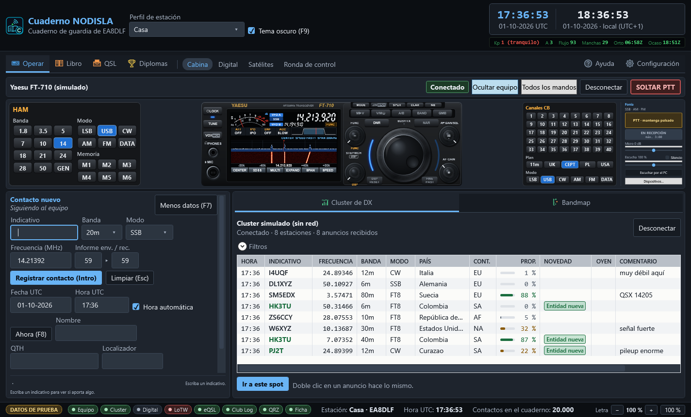
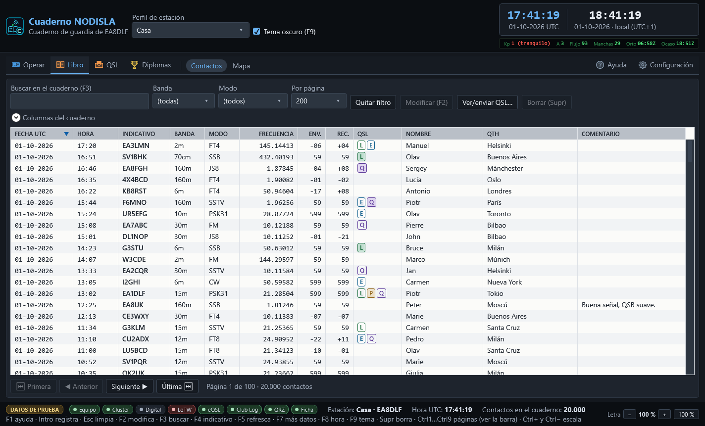
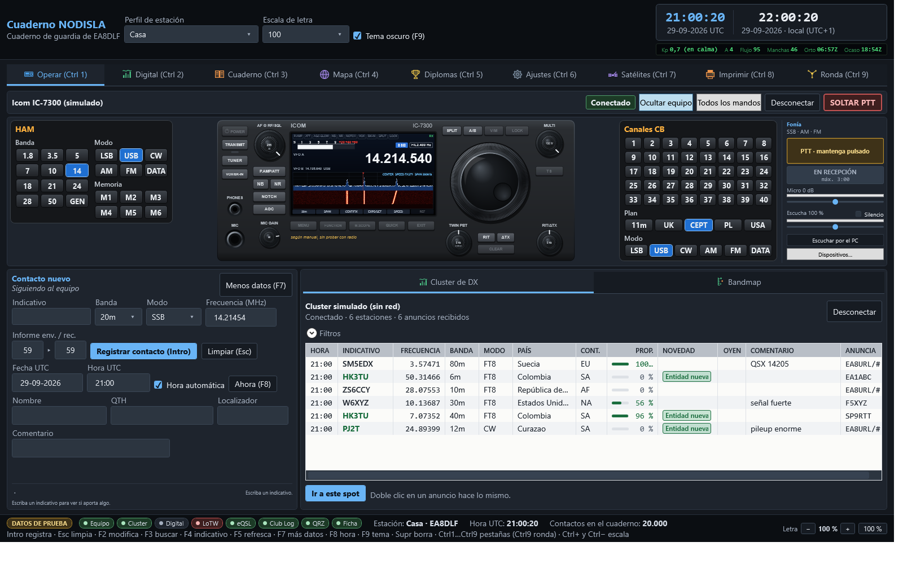
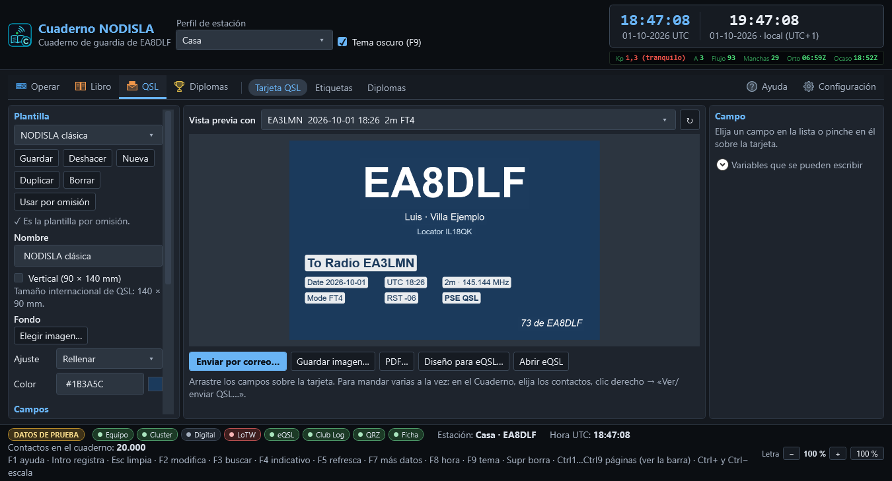

# Cuaderno NODISLA

Cuaderno de guardia para radioaficionados, en español, para Windows. Nace como alternativa a
Log4OM NextGen, con todo en castellano y un control a fondo de la radio por CAT. Reúne en un solo
programa el libro de contactos, el control del equipo con su frontal dibujado, el cluster de DX,
un módem propio de modos digitales, diplomas, mapa, satélites, e impresión y envío de QSL.

Autor: **EA8DLF** · Proyecto NODISLA · Contacto: nodisla@nodisla.org · Licencia **GPL-3.0**.



> Todas las capturas están hechas con el modo de demostración (`CUADERNO_SIMULADO`): los
> contactos, las estaciones y los datos del operador son inventados.

## Qué hace

- **Cuaderno**: entrada rápida por teclado, rejilla paginada con filtros y columnas a elegir,
  «trabajado antes», edición, fusión de duplicados sin perder confirmaciones, e importación y
  exportación ADIF/ADX de ida y vuelta.
- **Radio**: control CAT nativo con frontal dibujado para cada modelo:
  - **Yaesu** por CAT ASCII: FT-710 (validado contra la radio real, con analizador de espectro por
    el puente USB, pantalla MULTI con osciloscopio y AF-FFT, encendido y apagado), FT-891,
    FT-991/991A, FTDX10, FTDX101D/MP, FTDX3000, FTDX5000 y FTDX1200.
  - **Yaesu** por CAT binario: FT-817/818, FT-857 y FT-897.
  - **ICOM** por CI-V: IC-7300, IC-705, IC-7610, IC-9700, IC-7100 e IC-7851.
  - Cualquier otra radio, a través de Hamlib (`rigctld`) u OmniRig.

  Todo lo que no es el FT-710 está programado según el manual de cada modelo y **sin probar con
  la radio real**; el programa lo dice en pantalla. Un vigilante de PTT suelta la transmisión ante
  cualquier fallo.
- **Cluster de DX** por Telnet, con bandmap, filtros y aviso de entidad, banda o modo nuevos.
- **Módem digital propio**: FT8, FT4, FST4/FST4W, JT65, JT9, Q65, MSK144 y WSPR, sin depender de
  WSJT-X. También puede escuchar a WSJT-X/JTDX por UDP si se prefiere.
- **Fonía por el PC**: PTT desde el programa, con el micrófono y los altavoces del ordenador.
- **Diplomas**: progreso y lo que falta de 87 diplomas (DXCC, WAZ, WPX, IOTA, POTA, SOTA,
  WWFF…). El catálogo de referencias se instala aparte: ver más abajo.
- **Mapa** con contactos, spots, paso gris y trayectos; **satélites** con próximo paso, azimut y
  elevación en vivo y seguimiento Doppler; **propagación** por banda.
- **QSL**: editor de tarjetas, envío por correo, etiquetas Avery en PDF, eQSL, LoTW, QRZ, ClubLog
  y HamQTH. Las credenciales se guardan cifradas con la protección de datos de Windows.
- **Diseñador de diplomas**: plantillas propias para emitir diplomas a otras estaciones (con
  numeración, firma y envío por correo) o certificados de los diplomas conseguidos.
- **Ronda de control** para redes y net control.
- **Navegación por grupos** (Operar, Libro, QSL, Diplomas) y **Configuración por apartados**
  (cuentas, subidas, equipo, audio, fonía, cluster, correo, libro y actualizaciones).
- **Ayuda integrada** (F1) con capturas y buscador, y la misma ayuda en HTML en `docs/web-ayuda/`.
- **Avisos de versión nueva** (consulta la página pública de versiones de GitHub, sin datos del
  usuario) y **«Reportar un fallo»**, que prepara la incidencia, quita contraseñas, correos,
  localizadores y rutas personales, y la abre en GitHub para que el usuario la revise y la envíe.

| | |
|---|---|
|  |  |
|  |  |

La ayuda completa, con capturas, está en [`docs/ayuda/`](docs/ayuda/README.md). Los modelos de
radio se explican en [`docs/16-modelos.md`](docs/16-modelos.md),
[`docs/17-icom.md`](docs/17-icom.md) y [`docs/18-frontales.md`](docs/18-frontales.md).

## Requisitos

- Windows 10 (1809 o posterior) u 11, de 64 bits.
- Para compilar: [.NET SDK 8](https://dotnet.microsoft.com/download/dotnet/8.0).
- Para el instalador: [Inno Setup 6](https://jrsoftware.org/isinfo.php) (opcional).
- Una radio con CAT o CI-V (o ninguna: hay modo de demostración).

## Compilar y probar

```powershell
git clone https://github.com/EA8DLF/CuadernoNodisla.git
cd CuadernoNodisla
dotnet build CuadernoNodisla.sln -c Release
dotnet test CuadernoNodisla.sln -c Release
dotnet run --project src\Nodisla.Cuaderno.Ui
```

`tests\Nodisla.Cuaderno.Modos.Pruebas` incluye bancos de sensibilidad del módem que tardan cerca
de una hora; para una comprobación rápida, lance los demás proyectos de prueba uno a uno.

Para verlo sin radio ni red, con datos inventados:

```powershell
$env:CUADERNO_SIMULADO = "1"
dotnet run --project src\Nodisla.Cuaderno.Ui
```

## Publicar una versión

`herramientas\publicacion\Publicar-Version.ps1` compila, genera el instalador y prepara la
publicación en GitHub. Las plantillas de incidencias están en `.github/ISSUE_TEMPLATE/`.

## Instalar

```powershell
dotnet publish src\Nodisla.Cuaderno.Ui\Nodisla.Cuaderno.Ui.csproj -c Release -r win-x64 --self-contained true -o instalador\publicar\win-x64
& "C:\Program Files (x86)\Inno Setup 6\ISCC.exe" instalador\CuadernoNodisla.iss
```

El instalador queda en `instalador\salida\`. No necesita .NET instalado en el equipo destino y
nunca toca los datos del usuario, que viven en `%AppData%\CuadernoNodisla\`. Más detalles en
[`docs/07-instalador.md`](docs/07-instalador.md).

## Lo que hay que conseguir aparte

Estas piezas **no vienen en el repositorio** porque sus licencias no permiten redistribuirlas, o
no lo dejan claro. El programa compila y funciona sin ellas.

| Pieza | Para qué | Cómo |
|---|---|---|
| **Catálogo de diplomas** (`catalogo-diplomas.tsv.gz`, 553.064 referencias) | La pestaña Diplomas | Genérelo con `recursos\diplomas\generar-diplomas.py` desde su Log4OM y cópielo en `%AppData%\CuadernoNodisla\diplomas\` — ver [`recursos/diplomas/LEEME.md`](recursos/diplomas/LEEME.md) |
| **LibFT4222** de FTDI (`LibFT4222-64.dll`), de [ftdichip.com](https://ftdichip.com/products/ft4222h/) | Analizador de espectro del FT-710 | En `lib\ftdi\` antes de compilar — ver [`lib/ftdi/LEEME.md`](lib/ftdi/LEEME.md) |
| **ITURHFProp** de la UIT, de [ITU-R-HF](https://github.com/ITU-R-Study-Group-3/ITU-R-HF) | Predicción de propagación P.533 (sin él se usa una aproximación propia, marcada como tal) | En `herramientas\ITURHFProp\` — ver su [`LEEME.md`](herramientas/ITURHFProp/LEEME.md) |
| **Manuales CAT/CI-V** de [Yaesu](https://www.yaesu.com) e [ICOM](https://www.icomjapan.com) | Solo de consulta para desarrollar | No hacen falta para compilar |

Opcionales: Hamlib, OmniRig, WSJT-X o JTDX, si se quieren usar en lugar de lo propio.

La lista completa de componentes ajenos, con su licencia y procedencia, está en
[`TERCEROS.md`](TERCEROS.md).

## Estado del proyecto

Versión **0.1.0**, en desarrollo activo y en uso diario por su autor. Hecho y probado:
cuaderno, ADIF, control del FT-710 validado contra la radio real, cluster, módem digital propio,
diplomas, mapa, satélites, impresión y QSL por correo. Más de 2.400 pruebas automáticas.

Lo que falta o está a medias:

- Los modelos Yaesu distintos del FT-710 y todos los ICOM están hechos según manual y **sin
  probar con la radio real**; la lista de lo que hay que confirmar en cada uno está en
  `docs/16-modelos.md` y `docs/17-icom.md`.
- Concursos (catálogo, puntos, macros y Cabrillo) y manipulador y entrenador de CW: hechos y
  probados en sus bibliotecas, pero todavía sin pantalla en la interfaz.
- Solo Windows (WPF). La interfaz está en español; no hay traducciones.

La documentación técnica y las decisiones de diseño están en [`docs/`](docs/).

## Licencia

Cuaderno NODISLA es software libre: puede redistribuirlo y modificarlo bajo los términos de la
**Licencia Pública General de GNU, versión 3** (ver [`LICENSE`](LICENSE)). Se distribuye sin
ninguna garantía.

«Yaesu», «ICOM» y los nombres de sus modelos son marcas de sus respectivos dueños. Este proyecto
no tiene relación con Yaesu, ICOM, FTDI, la UIT ni Log4OM.
