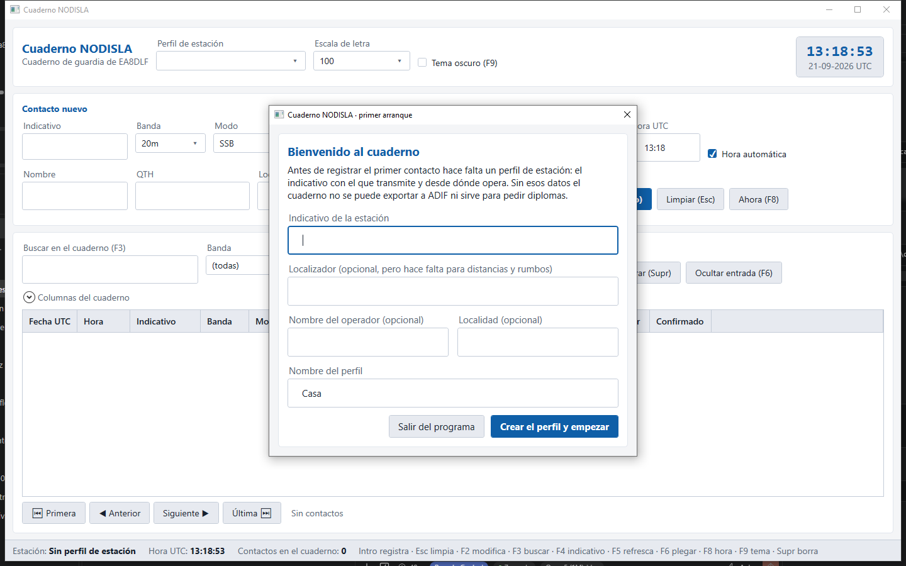

# Primer arranque

## El perfil de estación

La primera vez que se abre el programa, antes de dejar tocar nada, pide un **perfil de
estación**: el indicativo con el que transmite y desde dónde opera. Sin eso el cuaderno no se
puede exportar a ADIF ni sirve para pedir diplomas, así que no hay manera de saltárselo.

Los campos:

- **Indicativo de la estación** — el único obligatorio. Por ejemplo `EA8DLF`.
- **Localizador** — opcional, pero sin él no hay distancias ni rumbos en el cuaderno ni en el
  mapa. Por ejemplo `IL18QK`.
- **Nombre del operador** y **Localidad** — opcionales, solo para tenerlo escrito.
- **Nombre del perfil** — para distinguirlo si algún día se crean más (Casa, Portable,
  Concursos…). Por omisión pone «Casa».

Con «Crear el perfil y empezar» el cuaderno queda listo. «Salir del programa» cierra sin crear
nada, para cuando se ha abierto por error.

Se pueden tener varios perfiles de estación — por ejemplo uno para casa y otro para portable, o
con antenas distintas — y elegir cuál está activo desde el desplegable **Perfil de estación** de
la cabecera de la ventana principal, arriba a la izquierda. Los contactos se registran siempre
con el perfil que esté activo en ese momento.

## Traerse el cuaderno de Log4OM

Con el perfil ya creado, si el cuaderno está vacío el programa lo dice y ofrece traer el
respaldo de Log4OM: un fichero ADIF con todos los contactos antiguos.

**No se importa nada solo.** Meter miles de contactos sin que el operador lo haya pedido no se
hace, por muy bien que salga el proceso: se explica qué va a pasar y decide él con «Importar un
ADIF…» o «Empezar de cero».

Al importar:

- Se dice **dónde vive el cuaderno** — un solo fichero SQLite, fácil de copiar, con una carpeta
  `copias` al lado con las copias de seguridad automáticas.
- Los **duplicados se funden, nunca se descartan**. Si el mismo contacto aparece dos veces en el
  ADIF de origen con datos que no cuadran entre sí — por ejemplo una copia confirmada por LoTW y
  otra que no — se queda con lo mejor de las dos en vez de quedarse solo con la primera que
  encuentra.
- Al terminar se enseña el **parte entero**, con las **confirmaciones rescatadas** destacadas:
  es la cifra que justifica fundir las copias en vez de saltarlas, porque cada una es un diploma
  que no se pierde.

Este mismo ofrecimiento de importar, y el mismo parte al terminar, están también disponibles más
tarde desde **Ajustes → Cuaderno → Importar ADIF…**, así que no hace falta acertar a la primera:
se puede seguir importando ficheros ADIF de otras fuentes en cualquier momento.
