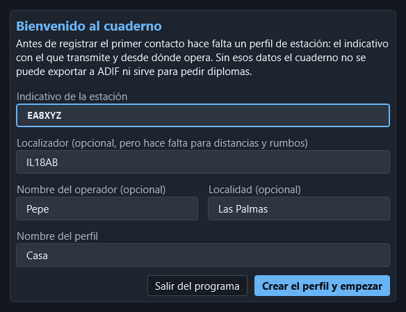
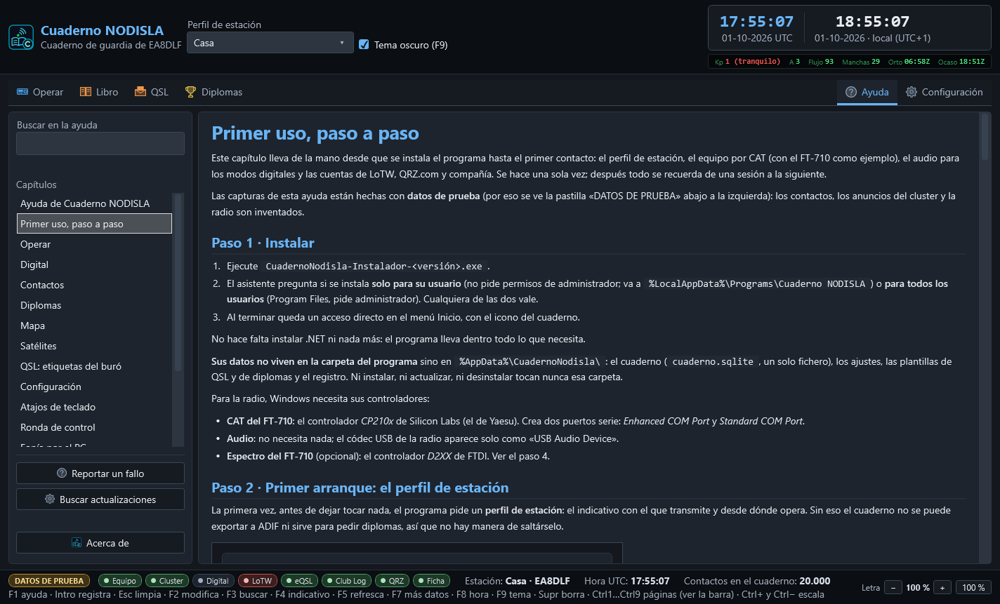

# Primer uso, paso a paso

Este capítulo lleva de la mano desde que se instala el programa hasta el primer contacto: el
perfil de estación, el equipo por CAT (con el FT-710 como ejemplo), el audio para los modos
digitales y las cuentas de LoTW, QRZ.com y compañía. Se hace una sola vez; después todo se
recuerda de una sesión a la siguiente.

Las capturas de esta ayuda están hechas con **datos de prueba** (por eso se ve la pastilla
«DATOS DE PRUEBA» abajo a la izquierda): los contactos, los anuncios del cluster y la radio son
inventados.

## Paso 1 · Instalar

1. Ejecute `CuadernoNodisla-Instalador-<versión>.exe`.
2. El asistente pregunta si se instala **solo para su usuario** (no pide permisos de
   administrador; va a `%LocalAppData%\Programs\Cuaderno NODISLA`) o **para todos los usuarios**
   (Program Files, pide administrador). Cualquiera de las dos vale.
3. Al terminar queda un acceso directo en el menú Inicio, con el icono del cuaderno.

No hace falta instalar .NET ni nada más: el programa lleva dentro todo lo que necesita.

**Sus datos no viven en la carpeta del programa** sino en `%AppData%\CuadernoNodisla\`: el
cuaderno (`cuaderno.sqlite`, un solo fichero), los ajustes, las plantillas de QSL y de diplomas
y el registro. Ni instalar, ni actualizar, ni desinstalar tocan nunca esa carpeta.

Para la radio, Windows necesita sus controladores:

- **CAT del FT-710**: el controlador *CP210x* de Silicon Labs (el de Yaesu). Crea dos puertos
  serie: *Enhanced COM Port* y *Standard COM Port*.
- **Audio**: no necesita nada; el códec USB de la radio aparece solo como «USB Audio Device».
- **Espectro del FT-710** (opcional): el controlador *D2XX* de FTDI. Ver el paso 4.

## Paso 2 · Primer arranque: el perfil de estación

La primera vez, antes de dejar tocar nada, el programa pide un **perfil de estación**: el
indicativo con el que transmite y desde dónde opera. Sin eso el cuaderno no se puede exportar a
ADIF ni sirve para pedir diplomas, así que no hay manera de saltárselo.

- **Indicativo de la estación** — el único obligatorio.
- **Localizador** — opcional, pero sin él no hay distancias, rumbos ni propagación.
- **Nombre del operador** y **Localidad** — opcionales.
- **Nombre del perfil** — para distinguirlo si algún día crea más (Casa, Portable…).

Pulse **Crear el perfil y empezar**. «Salir del programa» cierra sin crear nada.

Se pueden tener varios perfiles y elegir el activo en el desplegable **Perfil de estación** de la
cabecera. Los contactos se registran siempre con el perfil activo.

### Traerse el cuaderno anterior

Si el cuaderno está vacío, el programa lo dice y ofrece **importar un ADIF** (el respaldo de
Log4OM, de otro programa o de LoTW). **No importa nada solo**: decide usted con «Importar un
ADIF…» o «Empezar de cero». Los duplicados **se funden, nunca se descartan**, y al terminar se
enseña el parte con las confirmaciones rescatadas. Se puede importar más tarde desde
**Configuración › Libro (ADIF)**.

## Paso 3 · Conocer la ventana

Arriba, la cabecera con el perfil activo, el tema claro u oscuro y el reloj UTC y local, con la
franja solar debajo. Debajo, **una sola barra**:

- **Operar** — Cabina, Digital, Satélites y Ronda de control.
- **Libro** — Contactos y Mapa.
- **QSL** — Tarjeta QSL, Etiquetas y Diplomas (el diseñador).
- **Diplomas** — el seguimiento de los diplomas conseguidos y por conseguir.
- A la derecha, **Ayuda** (o `F1`) y **Configuración**.

Al elegir un grupo, sus páginas salen en la misma barra, a continuación. Abajo, la barra de
estado con las pastillas de cada servicio (verde al día, ámbar esperando, roja con un problema),
el número de contactos y el mando de la letra (`−`, `+`, `100 %`).

## Paso 4 · Configuración › Equipo (CAT), con el FT-710

Abra **Configuración** (a la derecha de la barra) y el apartado **Equipo (CAT)**.

1. **Vía de control**: *CAT nativo (Yaesu e ICOM)*. Es la única que da filtros, ruido,
   medidores, memorias y el frontal dibujado. (*rigctld* de Hamlib y *OmniRig* también están,
   para equipos que no estén en la lista.)
2. **Fabricante**: *Yaesu*. **Modelo**: *FT-710*. Si no lo sabe, deje la detección automática:
   el programa pregunta la identificación por cada puerto.
3. **Puerto serie**: el **Enhanced COM Port** del FT-710 (en el Administrador de dispositivos,
   *Silicon Labs Dual CP210x USB to UART Bridge: Enhanced COM Port*; es el que Yaesu llama
   CAT-1). El *Standard* (CAT-2) es para PTT y manipulación: no lo use para el CAT. Si no sabe el número, marque
   **Detectar automáticamente por qué puerto está el equipo**: se busca por lo que contesta la
   radio, nunca por el número.
4. **Velocidad**: **115.200**, y la misma en la radio: **MENU › OPERATION SETTING › GENERAL ›
   CAT-1 RATE = 115200 bps**. La velocidad la manda el equipo, no el cable; si no coinciden, no
   contesta.
5. **PTT**: *Por CAT*. Deje el **máximo en antena** en 180 s (tope duro 600 s): el vigilante
   suelta el PTT pase lo que pase.
6. Pulse **Probar**: abre, lee la identificación, la frecuencia y el modo, y cierra. **Nunca
   transmite.** Si contesta, **Aplicar**.

Después, en **Operar › Cabina**, pulse **Conectar**: sale el frontal del FT-710 con sus dos VFO.
**Abrir el programa nunca conecta solo con la radio**: conectar es siempre un botón.

### El espectro del FT-710 en la pantalla del frontal

El analizador del frontal enseña **el espectro de la propia radio**, no uno calculado aquí.
Para eso:

- En la radio: **MENU › OPERATION SETTING › GENERAL › SCU-LAN10 = ON**. No hace falta tener la
  SCU-LAN10: ese ajuste es el que abre la salida del espectro por el USB.
- En el PC: el controlador **D2XX de FTDI** (el FT-710 lleva dentro un puente FTDI FT4222).

Si falta algo, el analizador lo dice con letras («falta la biblioteca», «no aparece el
dispositivo», «no llegan tramas: mire SCU-LAN10»). El resto del programa funciona igual sin él.

### Otros equipos

Además del FT-710 hay **Yaesu** FTDX10, FTDX101D/MP, FT-991/991A, FT-891, FTDX3000, FTDX5000,
FTDX1200 y los de CAT antiguo (FT-817, FT-818, FT-857, FT-897), e **ICOM** IC-7300, IC-7610,
IC-705, IC-7100, IC-9700 e IC-7851 (por CI-V, con su dirección). Todos menos el FT-710 están
hechos **según el manual, sin probar con la radio**, y el programa lo avisa. Ver
[Equipos](15-equipos.md).

## Paso 5 · Configuración › Audio y digitales

1. **Entrada (del equipo)** y **Salida (al equipo)**: el códec USB de la radio. Sale marcado
   **EL EQUIPO** y el primero de la lista: se reconoce por el identificador USB, no por el
   nombre. En el FT-710 son *Micrófono (USB Audio Device)* y *Altavoces (USB Audio Device)*.
2. **Muestras por segundo**: 48.000.
3. **Probar el nivel** con la radio recibiendo ruido de banda: lo bueno está entre **0,20 y
   0,60**. Por encima de 0,90 el códec recorta; bájelo en la radio (en el FT-710, el nivel de
   salida de audio por USB del menú) hasta que quede en verde.
4. Las casillas de **Transmitir y apuntar** vienen bien de fábrica: preguntar antes de
   transmitir, no recordar el permiso de transmitir entre sesiones, y apuntar solo el contacto
   completo. Pulse **Guardar**.

Para los modos digitales, la radio tiene que estar en **DATA-U** (o DATA-L por debajo de
10 MHz), y para la fonía por el PC, con la fuente de modulación en USB: ver
[Fonía por el PC](12-fonia.md).

**El reloj del PC importa**: FT8 no perdona más de un segundo de desvío. En **Operar › Digital**
el reloj va arriba del todo, con **Medir** y **Poner el reloj en hora**. Ver
[Digital](03-digital.md).

## Paso 6 · Configuración › Cuentas y servicios

Una **tarjeta por servicio**, cada una con su estado arriba a la derecha (verde *Configurada*,
ámbar *Incompleta*, gris *Sin configurar*):

1. **QRZ.com** — usuario y contraseña (rellena nombre, QTH y localizador del corresponsal) y la
   *Clave del cuaderno de QRZ* para subir contactos (QRZ › Logbook › Settings › API).
2. **LoTW** — instale antes **TQSL** con su certificado. Escriba la **ubicación de estación de
   TQSL** (el nombre que le puso en TQSL, no su indicativo), la contraseña de LoTW y la frase de
   paso del certificado, y pulse **Guardar la cuenta**. La tarjeta dice con claridad qué falta.
3. **eQSL.cc**, **Club Log** (con su clave de API) y **HamQTH** (reserva de QRZ).
4. **Cluster de DX** y **Correo (SMTP)** llevan a sus apartados con **Configurar…**.

Las contraseñas se guardan **cifradas con la cuenta de Windows** y no se vuelven a enseñar. Con
las cuentas puestas, en **Subidas y QRZ** se marca qué servicios reciben cada contacto nuevo.
Detalles en [Configuración](09-ajustes.md).

## Paso 7 · Listo para operar

- En **Operar › Cabina**, **Conectar** el equipo y el cluster.
- Teclee un indicativo: el retrato le dice si aporta algo (país, banda o modo nuevo).
- **Intro** registra; **Esc** limpia; **F7** despliega más datos.

Y cuando dude: **F1** abre la ayuda por el capítulo de la página en la que esté. Desde la
propia Ayuda se puede **buscar**, **reportar un fallo** y **buscar actualizaciones**.

## Tres reglas que valen para todo el programa

- **Nada se conecta solo.** El equipo, el cluster y el módem arrancan desconectados.
- **Nada transmite solo.** Emitir, subir el PTT o llamar CQ son siempre botones explícitos, con
  **SOLTAR PTT** siempre a mano.
- **Las credenciales se cifran** y no se vuelven a mostrar.
