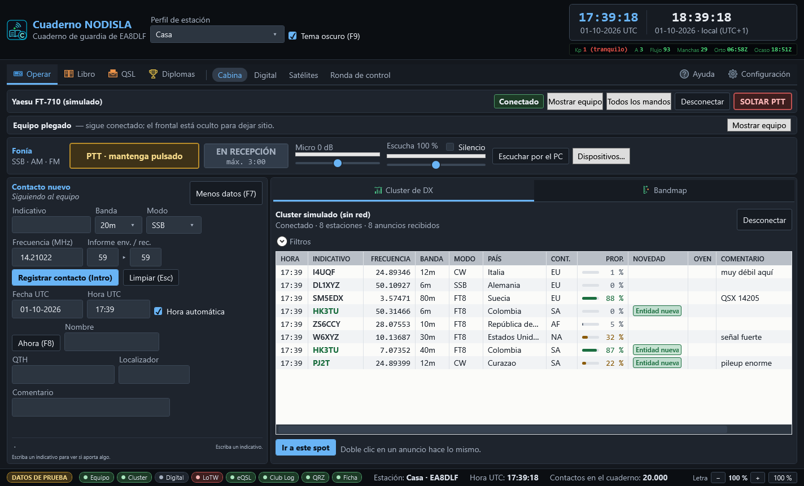

# Operar

**Operar › Cabina** (`Ctrl` `1`) es la página principal, la que se ve al abrir el programa: la
cabina donde se está mientras se opera. Arriba, el frontal del equipo a todo lo ancho, con la
botonera HAM a la izquierda, los canales CB y el panel de fonía a la derecha; abajo, a la
izquierda el contacto nuevo y a la derecha el cluster de DX.

La entrada **Operar** de la barra agrupa además **Digital** (`Ctrl` `2`), **Satélites**
(`Ctrl` `7`) y **Ronda de control** (`Ctrl` `9`).

## El frontal del equipo

Es un dibujo del frontal de la radio conectada, con sus mandos donde van en el equipo real, los
dos VFO, el S-metro y el dial. Se encoge con la ventana, pero nunca desaparece. Con el FT-710, la
pantalla enseña además **el espectro de la propia radio** y la vista **MULTI**. Los modelos,
el analizador y la botonera se explican en [Equipos](15-equipos.md).

Mientras no hay equipo conectado por CAT no hay frontal que dibujar, y en su lugar sale un aviso
con lo que hay que hacer: elegir la vía de control en **Configuración › Equipo (CAT)** y pulsar
«Conectar». **Abrir el programa nunca toca la radio por sí solo.**

Con el equipo conectado:

- **VFO A** y **VFO B**, con la frecuencia en grande y el modo al lado.
- El **S-metro**, el ROE, la tensión y la corriente cuando el equipo los da.
- Los mandos de verdad — `MODE`, `SPLIT`, `CLAR`, `NB`, `DNR`, ganancias — que se tocan igual
  que en la radio.
- El botón **SOLTAR PTT**, en rojo, siempre a mano: suelta el PTT ahora mismo, pase lo que pase,
  sin pedir confirmación. Es el botón de pánico.

La pantalla del frontal enseña pocas cosas y grandes, como la de la radio: el VFO activo en
grande, el otro debajo, `ATT` / `IPO` / `DNF` / `AGC` en corto y, si el dial cae fuera del plan
de bandas, un aviso corto en ámbar («Fuera de banda», «Tramo de CW»…). La explicación entera
sale al dejar el ratón encima.

- **Todos los mandos** despliega la lista completa de lo que declara el equipo.
- **Ocultar equipo** pliega el frontal para dar todo el alto al contacto y al cluster; el
  pliegue se recuerda de una sesión a la siguiente.
- A la derecha del frontal va el panel de **Fonía**: escuchar la radio por el PC y hablar con su
  micrófono. Ver [Fonía por el PC](12-fonia.md).
- Con el equipo en **CW** (o con el botón **CW** de la barra) sale bajo el frontal el panel de
  **Telegrafía**, que lee la CW que se oye. Ver [Telegrafía (CW)](17-cw.md).

## El contacto nuevo

Es el formulario de entrada, pensado para teclear deprisa durante un pileup: **Intro** registra,
**Escape** limpia y nunca hay que soltar el teclado para nada imprescindible.

La fila de siempre — indicativo, banda, modo, frecuencia, informes — no se oculta jamás. Una
segunda fila con fecha, hora, nombre, QTH, localizador y comentario se pliega y despliega con
**F7**.

**Cuando el equipo está conectado, la frecuencia, la banda y el modo los pone el dial**, y se
avisa con todas las letras («Siguiendo al equipo»). Registrar veinte contactos en la frecuencia
equivocada porque se creía que el programa seguía al dial es el error más caro de este cuaderno,
así que el aviso no se esconde.

Si el indicativo tecleado ya está en el cuaderno, aparece debajo un aviso de **trabajado antes**
con los contactos previos — fecha, banda, modo e informes — para no repetir sin saberlo.

### La ficha de QRZ.com

Al teclear el indicativo, un instante después se pide su ficha a **QRZ.com** (o a HamQTH si QRZ
no contesta) y se rellenan **Nombre**, **QTH** y **Localizador** — **solo si están vacíos**. Lo
que usted haya escrito no se toca nunca. Si cambia el indicativo, lo que puso la ficha del
anterior se quita solo; lo que escribió a mano se queda. Al lado de los campos aparece una línea
discreta con lo que dice la ficha: país, vía de QSL y si la estación usa LoTW o eQSL.

**Al guardar cualquier contacto** — desde este formulario, el registro automático de Digital o
la ronda de control — se completan además los demás campos vacíos: país, DXCC, zonas CQ e ITU,
provincia o estado, correo y QSL vía. Si QRZ tarda, el contacto se guarda ya y se completa en
cuanto llega la respuesta: el cuaderno nunca espera más de segundo y medio.

Las fichas se guardan 24 horas (en memoria y en disco), así que un indicativo no se pregunta dos
veces el mismo día. **Sin red o sin cuenta de QRZ el contacto se guarda igual**, sin mensajes que
molesten: solo la pastilla **Ficha** de la barra de estado se pone ámbar y dice por qué. Sin
suscripción XML de pago, QRZ.com solo da una parte de la ficha (nombre y QTH, normalmente); se
aprovecha lo que haya.

### La subida automática a LoTW, eQSL, Club Log y QRZ

Cada contacto que se guarda se sube solo a los servicios marcados en **Configuración → Subidas y QRZ → Subida
automática**. En la barra de estado hay una pastilla por servicio:

- **Verde**: al día.
- **Ámbar, con un número**: contactos esperando turno o reintentando (sin red, servicio caído).
- **Roja**: no se puede subir — falta TQSL o la ubicación de estación de LoTW, faltan
  credenciales — o hay contactos que fallaron después de varios intentos.
- **Apagada**: el servicio está desmarcado o sin cuenta.

Pase el ratón por encima para leer el estado con palabras. En la columna QSL del cuaderno el
contacto sale como **enviado** en cuanto el servicio lo acepta.

Si modifica con **F2** un contacto ya subido, **Club Log y QRZ reciben la corrección**. **LoTW no
admite modificar** lo que ya se firmó (eQSL tampoco): allí queda como se subió, y el mensaje de
«cambios guardados» lo recuerda.

### El retrato del indicativo: ¿le llamo o no?

Debajo del formulario, dos rejillas que responden sin leer una frase:

- **La matriz de novedad**: tres filas — país, banda, modo — por cuatro vías de confirmación —
  papel, eQSL, LoTW, QRZ. Verde es «nuevo, merece la pena»; ámbar es «lo tiene pero sin confirmar
  por ahí»; apagado es «ya está cerrado». Una raya es «no se sabe» — pasa cuando todavía no hay
  banda ni modo escritos. Si algo aporta, aparece la pastilla **«APORTA»** junto al indicativo.
- **La matriz de banda por modo**: el «trabajado antes» condensado en catorce bandas por tres
  familias — fonía, CW, digitales. Vacía es sin trabajar, un número es trabajado tantas veces, y
  un ✓ es confirmado.

Ninguno de los dos datos es nuevo — el cuaderno ya los tenía — lo que faltaba era enseñarlos. El
color nunca va solo: cada casilla lleva también su palabra o su marca, para quien no distinga
bien los colores.

## El cluster de DX y el bandmap

A la derecha, dos vistas del mismo cluster:

- **Cluster de DX**, una rejilla con **una fila por estación**, la más reciente arriba. Columnas:
  hora, indicativo, frecuencia, banda, modo, país, continente, **PROP.**, novedad, **OYEN**,
  comentario y quién lo anuncia. Si la misma estación se anuncia varias veces en la misma banda
  y el mismo modo no se repite la fila: se actualiza con el último anuncio y **OYEN** dice
  cuántas estaciones distintas la están oyendo (×3, ×10…), que es la señal de que entra bien.
  Lo que aporta algo lleva la pastilla verde: rellena si sería **entidad nueva**, solo con
  contorno si llena un hueco de **banda/modo**. Pinchar en una cabecera ordena por esa columna.
  Los filtros — banda, modo, continente, «solo lo nuevo», «solo con propagación», «sin escucha
  automática» — están plegados en **«Filtros»**.

### «PROP.»: mi propagación hacia esa estación

La columna **PROP.** dice, para cada fila, la probabilidad de que la banda esté abierta **ahora**
entre tu localizador y esa estación, en la frecuencia y el modo en que la anuncian (un FT8 se
oye con mucha menos señal que una fonía). La barrita y la cifra van en **verde** del 50 % para
arriba, en **ámbar** del 20 % al 50 % y en **gris** por debajo. Al dejar el ratón encima sale el
detalle: fiabilidad, relación señal/ruido prevista, MUF del trayecto, distancia, rumbo y de dónde
se ha sacado la posición de la estación.

- **Tu posición** es el localizador del perfil activo (si el perfil no lo tiene, se completa al
  arrancar con el de tu último contacto).
- **La posición de la otra estación**, por orden: el localizador que manda el nodo, el que consta
  en el cuaderno de un contacto anterior, y si no hay ninguno, el prefijo o el centro de su
  entidad DXCC.
- Se calcula con los índices solares del momento, para 100 W, y se rehace cada cuarto de hora y
  cada vez que llegan índices nuevos. Es una estimación para decidir si merece la pena girar el
  dial, no una garantía.
- **Celda vacía** quiere decir que no hay con qué calcularlo: sin índices solares, sin tu
  localizador, sin posición de la estación, o fuera de HF (VHF y superiores). No se inventa un
  número.

El filtro **«Solo con propagación»** deja solo las filas en verde o en ámbar.

### El bandmap

- **Bandmap**, el mismo cluster pero por frecuencia: una regla vertical con la banda entera y los
  anuncios colocados a la altura que les toca, con la línea roja marcando dónde está el dial.
  Dice de un vistazo dónde está llena la banda y dónde hay hueco.

Un doble clic en cualquier anuncio — de la lista o del bandmap — lleva el equipo a esa frecuencia
y pone el indicativo en el formulario, listo para trabajarlo. El botón **«Ir a este spot»** hace
lo mismo con el anuncio seleccionado.

La conexión al cluster se abre y se cierra con el botón de la cabecera de este panel; los datos
del nodo — servidor, puerto, indicativo, contraseña — se configuran en **Configuración → Cluster**.
