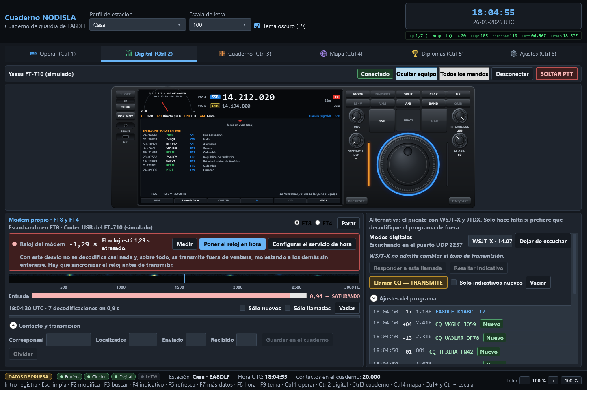
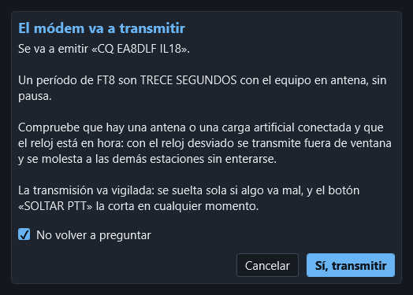

# Digital

**Operar › Digital** (`Ctrl` `2`) es la página de los modos digitales, con el mismo frontal del
equipo arriba. Todos los modos los hace **esta aplicación**, con su propio módem: no hay que
abrir WSJT-X, JTDX ni ningún otro programa. El audio entra por el códec USB del equipo, la
cascada se calcula aquí y las decodificaciones salen tal cual se ven en pantalla.

## Los modos

Se eligen en el desplegable **Modo**, arriba a la derecha, con su período al lado.

| Modo | Para qué | Ventana | Cómo se apunta en ADIF |
|---|---|---|---|
| **FT8** | El de diario en HF y 6 m | 15 s | `FT8` |
| **FT4** | Más rápido, concursos | 7,5 s | `MFSK` / `FT4` |
| **WSPR** | Balizas de propagación (no hace contactos) | 2 min | `WSPR` |
| **JT65** | Lento, HF débil y EME | 1 min | `JT65` |
| **JT9** | Lento y muy estrecho, bandas bajas | 1 min | `JT9` |
| **Q65** | VHF, EME y dispersión (submodo A) | 1 min | `MFSK` / `Q65` |
| **MSK144** | Dispersión meteórica | 15 s | `MSK144` |
| **FST4** | Lento, para 2200 y 630 m | 1 min | `MFSK` / `FST4` |
| **FST4W** | Baliza, como WSPR (no hace contactos) | 2 min | `MFSK` / `FST4W` |

El modo ADIF va bien puesto para que los contactos cuenten en los diplomas por modo: FT8, JT65,
JT9 y MSK144 son modos principales; FT4, Q65, FST4 y FST4W son submodos de MFSK.

**Ir a la frecuencia del modo** mueve el equipo por CAT a la frecuencia de ese modo en la banda
del dial. La tabla de frecuencias de trabajo se puede retocar: **Añadir** (el modo y el dial
actuales), **Quitar**, **Ir a la elegida** y **Las de WSJT-X**, que vuelve a la tabla de
fábrica con las frecuencias habituales. En **Operación** se elige cómo se opera: *Normal*, *Hound* (llamar a una
expedición en modo fox/hound), *Fox* y los concursos *NA VHF*, *EU VHF*, *Field Day*, *RTTY
Roundup* y *WW Digi*, con su **Intercambio**.

## El módem propio

### El reloj, antes que nada

FT8 va en ventanas de quince segundos alineadas al reloj universal (FT4, de 7,5 segundos). Un
ordenador con el reloj un segundo desviado decodifica mal; con dos segundos, ya no decodifica
nada y además **transmite fuera de ventana** — que deja de ser un problema propio y pasa a ser
un problema ajeno: ocupa el período de otra estación y le ensucia las decodificaciones sin que
nadie se entere. Por eso el reloj va arriba del todo, con un semáforo de colores, y no escondido
en Configuración.

- **Medir** pregunta la hora a los servidores de hora y recalcula el desvío.
- **Poner el reloj en hora** mide y escribe la hora del sistema — nunca se hace solo, siempre es
  un botón que pulsa el operador.
- **Configurar el servicio de hora** deja el servicio de Windows apuntando a un buen servidor,
  que arregla el problema para siempre y no solo por hoy.

Junto al reloj, una cuenta atrás con su propia barra dice cuánto queda de la ventana en curso
(los segundos del período del modo elegido, no solo en FT8: 7,5 s en FT4, 2 min en WSPR…), para
saber de un vistazo si hay tiempo de sobra o si está a punto de cerrarse.

### La cascada

El espectro de audio en el tiempo, con la frecuencia en el eje horizontal. Pinchar en la cascada
pone ahí el **tono de transmisión**. Debajo, el medidor de **nivel de entrada** avisa y no solo
pinta: por encima de 0,90 el codec recorta y las señales débiles se pierden — la barra se pone
roja y lo dice con letras — y lo bueno está entre 0,20 y 0,60.

### Decodificación normal y decodificación «rescatada»

Cada línea de la lista de decodificaciones lleva la hora, la relación señal-ruido en decibelios,
el desfase respecto a la ventana, el tono en hercios y el mensaje. Los indicativos nuevos salen
en verde y en negrita; lo que va dirigido a la propia estación, en el color de acento.

Una decodificación puede salir marcada **«RESCATADA»**: son señales muy débiles que solo se han
podido leer gracias al bloque de corrección profunda del módem, con algo más de riesgo de ser
falsas que una decodificación normal. La marca existe para que se puedan mirar con más cuidado
antes de apuntar un contacto con ellas — no para desconfiar de todas, solo de saber cuáles son.

### Transmitir cuesta abrir un pestillo

Emitir un período de FT8 son **trece segundos con el equipo en antena**. Por eso hay un
interruptor, «Permitir transmitir en esta sesión», que **empieza cerrado en cada arranque y no
se guarda de una sesión a otra**: hay que abrirlo cada vez, y solo con la antena o la carga
artificial puestas. Con el pestillo cerrado, «Emitir» no hace nada. Con él abierto, «Cortar y
soltar PTT» corta la emisión y suelta el PTT sin preguntar.

Si prefiere que el pestillo arranque abierto, marque **«Recordar «Permitir transmitir» entre
sesiones»** en Configuración › Audio y digitales (viene apagado).

Antes de cada emisión sale además una pregunta de confirmación. Tiene una casilla **«No volver a
preguntar»**: márquela y pulse «Sí, transmitir», y ya no se pregunta más. Para que vuelva a
preguntar, marque **«Preguntar antes de transmitir con el módem»** en Configuración › Audio y
digitales. Quitar la pregunta no quita la seguridad: el vigilante del PTT (tiempo máximo en
antena, suelta si se pierde el latido o se cierra el programa), la negativa a emitir con el reloj
fuera de ventana y la negativa a emitir sin salida de audio siguen siempre.

El bloque «Contacto y transmisión» tiene además los datos del corresponsal — indicativo,
localizador, informes enviado y recibido — y el botón «Guardar en el cuaderno», que apunta el
contacto con la frecuencia del dial más el tono de audio, y el modo tal como lo pide ADIF: FT8
va como modo principal y FT4 como submodo de MFSK.

### El contacto se guarda solo al completarse

Con la secuencia automática, el contacto **se apunta solo en el cuaderno** en cuanto está hecho,
sin pulsar «Guardar en el cuaderno»:

- cuando el corresponsal manda RR73, RRR o 73 después de intercambiar informes, o
- cuando sale su RR73 después de haber recibido su R+informe.

Se guarda con indicativo, localizador, informes enviado y recibido, frecuencia (dial más tono de
transmisión), modo ADIF, hora de inicio (la primera emisión o recepción del contacto) y hora de
fin. En la pantalla aparece un aviso corto, por ejemplo «Guardado: EA1ABC 20m FT8», y se
refrescan el cuaderno, el mapa, los diplomas y las subidas automáticas, igual que al guardar a
mano. Si el corresponsal repite el 73 no se apunta dos veces, y un contacto que se queda a medias
no se apunta. Si no se sabe la frecuencia del dial no hay banda que apuntar: sale el aviso y se
guarda con el botón. Se apaga en Configuración › Audio y digitales, con **«Guardar solo en el
cuaderno el contacto completo»**.

### La secuencia automática y los mensajes

A la derecha, los seis mensajes **Tx1 … Tx6** se componen solos con su indicativo, su
localizador y el del corresponsal (**Generar** los rehace). **Doble clic** en un mensaje lo
envía; la marca redonda dice cuál es el siguiente. **Llamar CQ** empieza a llamar y **Detener**
para. Con **Secuencia automática**, al contestar alguien se pasa solo al mensaje que toca:

- **Saltar Tx1** — al contestar a un CQ se empieza por el informe (Tx2).
- **Llamar al primero** — llamando CQ, se contesta solo al primero que llame.
- **AnsB4** — llamando CQ, no se elige automáticamente a quien ya se ha trabajado antes (se le
  puede seguir contestando a mano con el doble clic; apagada de fábrica).
- **1 QSO** — al completar un contacto que venía de llamar CQ con «Llamar al primero», se para
  del todo en vez de seguir llamando CQ solo para el siguiente que conteste (encendida de
  fábrica: es como se ha comportado siempre el programa).
- **Tx4 con RRR** — en vez de RR73.
- **Parar tras** *n* **ciclos sin respuesta** — deja de insistir.

En la lista de decodificaciones, **doble clic** en una línea prepara la respuesta a esa
estación: pone su indicativo y su localizador en el contacto y compone los mensajes. **Mantener
Tx** deja quieto el tono de transmisión (solo se mueve con `Mayús` + clic o escribiéndolo en
**Tx**). Los filtros **Sólo CQ**,
**Sólo a mí** y **Sólo nuevos** aclaran la lista cuando la banda está llena, y **Vaciar** la
limpia. **WAV…** decodifica una grabación.

### Más opciones

- **Paleta**, **Ganancia**, **Cero**, **Promedio** y **Ancho** ajustan cómo se pinta la cascada.
- **Mandar lo que se oye a PSK Reporter** (apagado de fábrica): envía cada 5 minutos lo
  decodificado, con su indicativo y su localizador.
- **Guardar un WAV de cada ventana** y **Apuntar todas las decodificaciones en
  decodificaciones.txt**, para revisar después; van a la carpeta de datos del programa.
