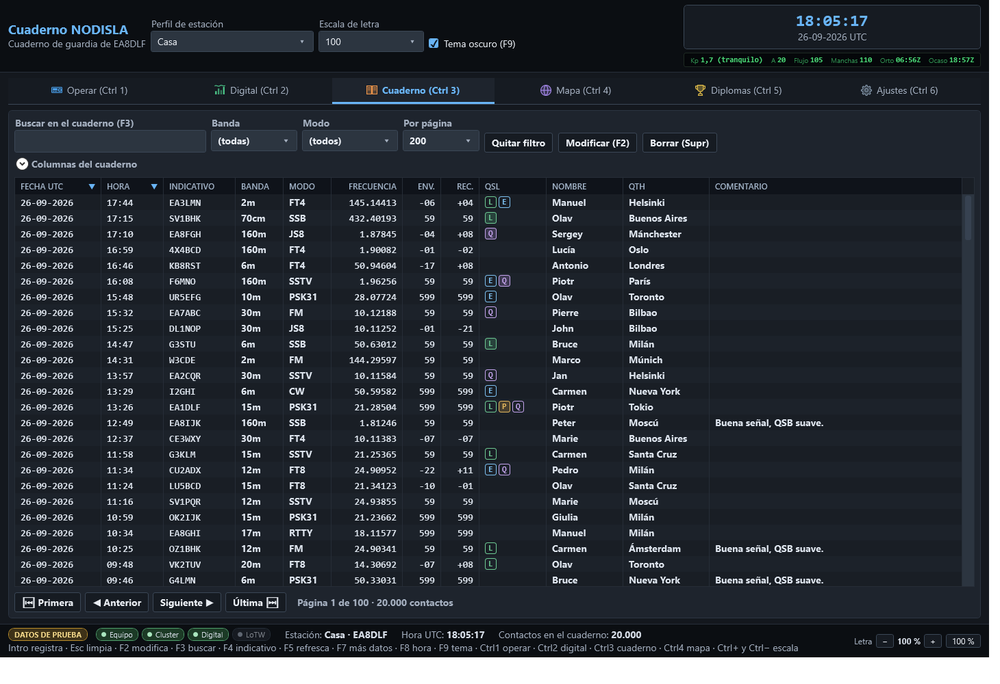

# Cuaderno

Es la rejilla de contactos, con su propia pestaña — antes ocupaba toda la ventana, cuando no
había nada más, y ahora tiene el sitio entero para ella sola, que es lo que necesita una rejilla
de veinte mil filas.

## Buscar y filtrar

- **Buscar en el cuaderno (F3)** — busca por indicativo, nombre, QTH, localizador, país o
  comentario a la vez, sin tener que elegir en cuál de esos campos.
- **Banda** y **Modo** — filtran a un valor concreto.
- **Por página** — cuántas filas se cargan de golpe; la rejilla está paginada porque un cuaderno
  de miles de contactos no se carga entero en memoria cada vez.

Si el filtro no deja pasar ninguna fila, el cuaderno lo dice en el centro de la rejilla: una
rejilla en blanco no distingue por sí sola entre «no hay contactos» y «el filtro no deja pasar
ninguno», y son dos cosas muy distintas.

## Las columnas

El desplegable **«Columnas del cuaderno»** deja encender y apagar columnas: frecuencia, informes,
nombre, QTH, localizador, distancia, comentario, mi indicativo, confirmaciones, antena,
propagación, radioescucha, completado, casual, mensaje QSL, mi nombre, IOTA. Se puede ordenar
por cualquier columna con clic en su cabecera, cambiar su ancho y reordenarlas arrastrando.

La columna **QSL** no dice «Sí» o «No»: enseña cuatro pastillas — **L** de LoTW, **E** de eQSL,
**P** de papel, **Q** de QRZ — rellenas cuando esa vía en concreto ha confirmado el contacto, así
se ve de un vistazo por dónde está confirmado y por dónde no.

## Editar y borrar

- **Modificar (F2)** o doble clic en una fila abre el editor del contacto seleccionado.
- **Borrar (Supr)** lo elimina, pidiendo confirmación antes.
- **Quitar filtro** limpia la búsqueda y los filtros de banda y modo de golpe.
- **Ver/enviar QSL…** (botón, o clic derecho en la rejilla) abre la tarjeta QSL de los contactos
  elegidos para verla, guardarla o mandarla por correo. Se pueden elegir varios con Ctrl/Mayús +
  clic. Ver [Tarjeta QSL propia](13-tarjeta-qsl.md).

## Fusión de duplicados al importar

Cuando se importa un fichero ADIF — desde **Ajustes → Cuaderno → Importar ADIF…**, o desde la
ventana de bienvenida la primera vez — los contactos que ya están en el cuaderno **no se
duplican ni se descartan: se funden**. Si dos copias del mismo contacto traen datos distintos
—por ejemplo una con la QSL confirmada por LoTW y otra sin esa confirmación—, el resultado se
queda con lo mejor de las dos.

Al terminar la importación se enseña el parte completo, con las **confirmaciones rescatadas**
destacadas aparte: es la cifra que demuestra por qué merece la pena fundir en vez de saltarse
los duplicados sin más — cada una es un diploma que no se pierde por el camino.
