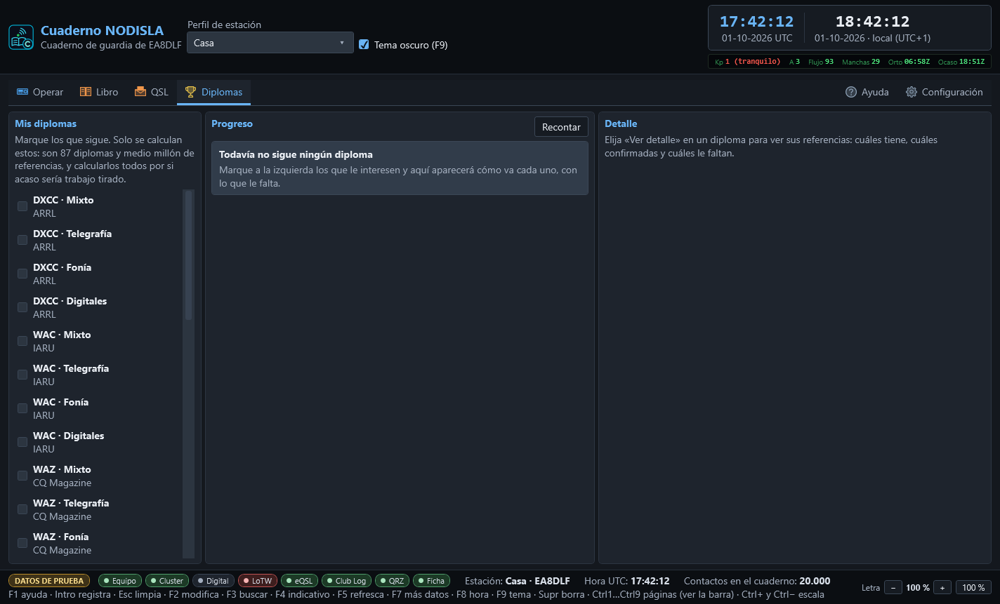

# Diplomas

La entrada **Diplomas** de la barra (`Ctrl` `5`) sigue los diplomas que se van consiguiendo.
Para **diseñar e imprimir** diplomas propios o el certificado de uno conseguido está
[QSL › Diplomas](14-disenador-de-diplomas.md).

La pantalla tiene tres bloques: a la izquierda el catálogo para elegir los propios,
en el centro cómo van los que se siguen, y a la derecha el detalle de uno — qué referencias
tiene, cuáles confirmadas y cuáles faltan.

## Elegir qué diplomas seguir

El catálogo trae **87 diplomas** — DXCC, WAS, WAZ, WAC, WPX, IOTA, SOTA, POTA, WWFF y muchos
más — con **medio millón de referencias** entre todos. Marcando la casilla de uno se empieza a
seguir; **solo se calculan los marcados**, porque recalcular los ochenta y siete por si acaso
sería trabajo tirado sobre esa cantidad de referencias. Por eso, sin ninguno elegido, la pantalla
invita a marcar en vez de fingir que está calculando algo.

## Qué son NEW, BAND y MODE

Cuando se elige un diploma que se calcula por país — como el DXCC — el progreso distingue tres
formas de que una entidad cuente:

- **NEW** (nuevo) — la entidad no está en absoluto en el cuaderno con ese diploma.
- **BAND** — la entidad ya está trabajada, pero no en esa banda concreta.
- **MODE** — la entidad ya está trabajada, pero no en ese modo concreto.

Es la misma idea que la matriz de novedad de **Operar › Cabina**: no basta con haber
trabajado un país una vez, hace falta trabajarlo (y a veces confirmarlo) en cada banda y en cada
modo para que cuente en según qué diploma.

## Las vías de confirmación

Un contacto puede estar trabajado pero no confirmado, y un diploma solo se concede con
confirmaciones de verdad. Las vías que sigue el cuaderno son las mismas cuatro que en el resto
del programa: **papel**, **eQSL**, **LoTW** y **QRZ**. El botón **«Ver detalle»** de cada diploma
abre a la derecha la lista completa de sus referencias, con tres estados posibles por cada una:
**falta** (sin trabajar), **sin QSL** (trabajada pero no confirmada) y **confirmada**. El estado
va siempre escrito además de en color, para quien no distinga bien los colores.

Los diplomas grandes — SOTA pasa de 182.000 referencias — se enseñan paginados, con los botones
◀ y ▶ debajo de la lista.

## Cuándo una cifra no es firme

Junto a algunos progresos aparece un aviso ámbar: **«La cifra es un mínimo, no la definitiva»**.
Pasa con los diplomas que su propio gestor valida contra una base externa, o que cuentan por
campos que este cuaderno todavía no guarda: en esos casos la cifra que se enseña es una **cota
inferior**, nunca una cifra de más. El aviso va siempre junto al número, no escondido en una
ayuda emergente — enseñar la cifra sin decirlo llevaría a pedir un diploma que en realidad no se
tiene, o a no pedir uno que sí.

El botón **«Recontar»** vuelve a calcular el progreso de los diplomas elegidos, por si se ha
importado o editado el cuaderno desde la última vez.
