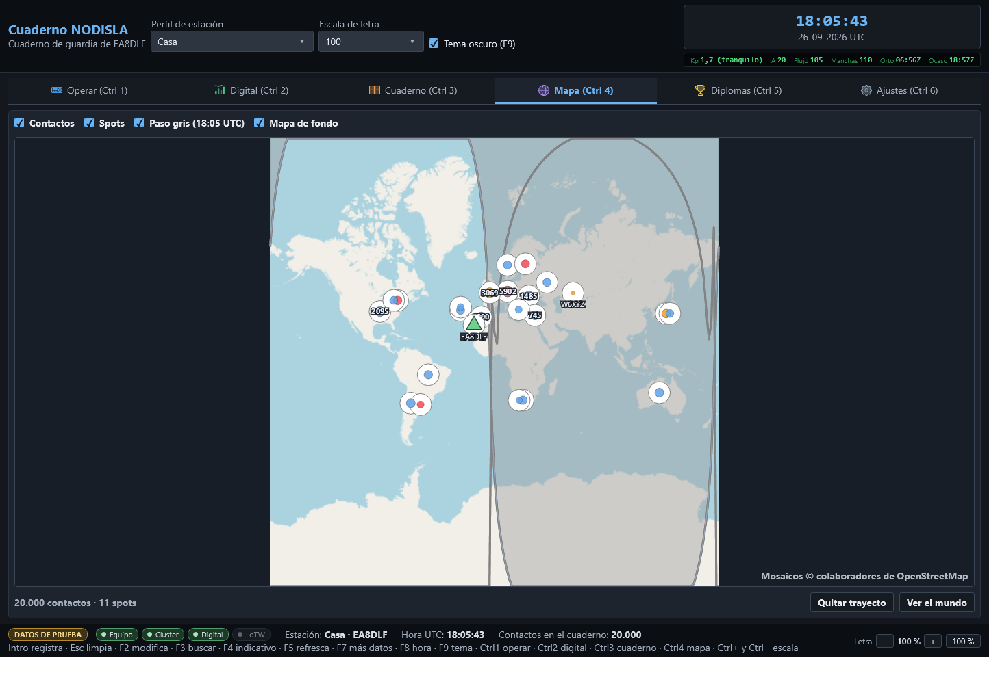

# Mapa

El mapa enseña dónde están los contactos del cuaderno y los anuncios del cluster, con la propia
estación marcada con un triángulo verde.

## Qué se ve

Cuatro casillas arriba controlan qué se dibuja:

- **Contactos** — los contactos del cuaderno, agrupados en globos cuando hay varios muy juntos;
  el número dentro del globo dice cuántos.
- **Spots** — los anuncios que llegan ahora mismo del cluster de DX.
- **Paso gris** — la línea de día y noche, que se mueve sola con el reloj y enseña la hora a la
  que corresponde.
- **Mapa de fondo** — los mosaicos de OpenStreetMap. Sin conexión a internet el mapa se queda en
  un fondo liso y sigue funcionando igual de bien para ver posiciones y trayectos.

## Trayectos

Al elegir un spot o un contacto se traza el trayecto de círculo máximo entre la propia estación
y esa estación. **«Quitar trayecto»** lo borra; **«Ver el mundo»** vuelve a encuadrar el mapa
entero, para cuando el zoom se ha quedado metido en una zona.

El resumen de abajo dice cuántos contactos y cuántos spots hay dibujados en ese momento, y avisa
si el mapa está todavía cargando el cuaderno o si algo ha fallado al traer los mosaicos.

## Rendimiento de las teselas

El control de mapa es su propio proyecto, separado de la ventana principal, precisamente porque
los controles de mapa son la pieza que más se rompe entre versiones de sus bibliotecas: si algún
día hay que cambiarlo, no hace falta tocar el resto del programa. Las teselas se guardan en
caché en disco, así que no hace falta descargarlas de nuevo cada vez que se abre el mapa.
