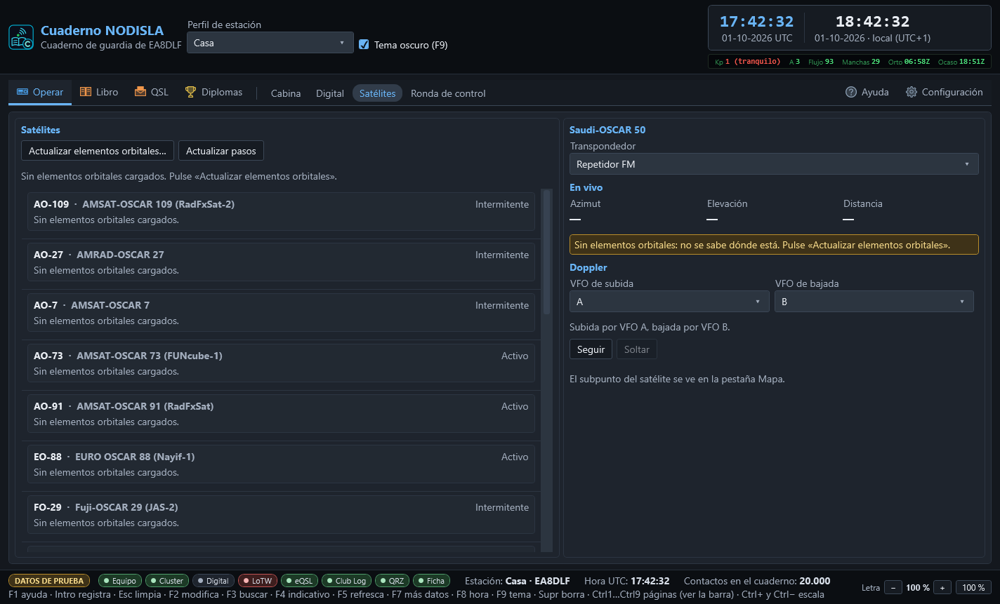

# Satélites

**Operar › Satélites** (`Ctrl` `7`) tiene dos columnas: a la izquierda el catálogo con el próximo
paso de cada satélite, a la derecha el satélite elegido con sus datos en vivo y el seguimiento
Doppler.

## El catálogo y el próximo paso

La lista de la izquierda trae los satélites de aficionado en servicio — activos e
intermitentes —, cada uno con su próximo paso por encima del horizonte. El texto del paso
cambia de color según lo que diga:

- **Gris apagado** — todavía no hay elementos orbitales cargados para ese satélite; no se puede
  calcular nada hasta pulsar «Actualizar elementos orbitales…».
- **Ámbar** — el paso es **rasante**: sube poco antes de volver a ponerse, así que cualquier
  obstáculo (un edificio, un árbol) puede tapar la ventana de trabajo casi entera.
- **Rojo** — los elementos orbitales de ese satélite son **viejos**: el cálculo del paso ya no es
  de fiar y conviene actualizarlos antes de confiar en la hora que da.

Ningún dato se descarga solo: **«Actualizar elementos orbitales…»** es la única puerta a la red
de esta pantalla, y hay que pulsarla a propósito. **«Actualizar pasos»** solo recalcula con lo
que ya hay descargado, sin salir a internet.

## El satélite elegido: en vivo

Al elegir un satélite de la lista aparece, a la derecha, su **transpondedor** (repetidor de FM,
lineal, digital o baliza, según lo que tenga) y tres datos que se actualizan solos mientras la
página está abierta: **azimut**, **elevación** y **distancia**. Si el satélite está por debajo
del horizonte en ese momento, lo dice con un aviso en vez de enseñar cifras que no significan
nada.

## Doppler: seguir y soltar

Con el equipo conectado y dando sus dos VFO, se puede elegir cuál sigue la **subida** y cuál la
**bajada**, y pulsar **«Seguir»**: a partir de ahí el cuaderno corrige la frecuencia de cada VFO
en tiempo real para compensar el Doppler del paso, sin que haga falta perseguirlo a mano.
**«Soltar»** para de tocar el equipo en cualquier momento. Mientras se sigue, se ven los dos
**desplazamientos** aplicados, en hercios, y un aviso si el equipo no informa de sus dos VFO —
en ese caso no hay manera de seguir el Doppler y la pantalla lo dice en vez de fallar en
silencio.

El seguimiento **solo mueve frecuencia**: nunca toca el PTT ni el modo del equipo por su cuenta.

## El subpunto en el mapa

Mientras hay un satélite elegido, su subpunto —el lugar de la superficie terrestre sobre el que
vuela en ese instante— se dibuja como una marca más en **Libro › Mapa**, junto a los
contactos y los spots del cluster.
