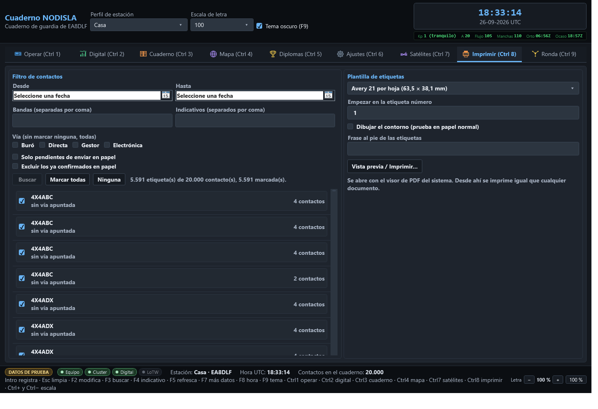

# Impresión de QSL

La pestaña **Imprimir (Ctrl 8)** tiene dos subpestañas: **Etiquetas**, que se explica aquí, y
**Tarjeta QSL**, el editor de su propia tarjeta y su envío por correo (ver
[Tarjeta QSL propia](13-tarjeta-qsl.md)).

**Etiquetas** compone etiquetas de QSL listas para pegar en el sobre. A la
izquierda se filtran los contactos y se eligen las etiquetas de la tirada; a la derecha se elige
el papel y se pide la vista previa.

## El filtro de contactos

- **Desde / Hasta** — un rango de fechas, opcional.
- **Bandas** e **Indicativos** — listas separadas por coma; en blanco quiere decir «todas» o
  «cualquiera».
- **Vía** — Buró, Directa, Gestor, Electrónica. Sin marcar ninguna cuentan todas.
- **Solo pendientes de enviar en papel** — viene marcado de fábrica, porque una tirada de
  etiquetas normalmente sale de la cola de tarjetas por mandar.
- **Excluir los ya confirmados en papel** — apagado de fábrica: confirmar también lo que ya llegó
  es correcto y es lo que se espera, así que por omisión no se excluye.

**«Buscar»** aplica el filtro y llena la lista de etiquetas, agrupadas por corresponsal, cada una
con su casilla para entrar o no en la tirada y el número de contactos que reúne. **«Marcar
todas»** y **«Ninguna»** cambian todas las casillas de golpe.

## La plantilla y la tirada

- **Plantilla de etiquetas** — el papel sobre el que se va a imprimir, por ejemplo «Avery 21 por
  hoja (63,5 × 38,1 mm)». Las medidas son las del fabricante y no se retocan: si algo sale
  corrido al imprimir, lo que está mal es el escalado de la impresora — hay que imprimir **al
  100 %**, nunca «ajustar a la página».
- **Empezar en la etiqueta número** — para aprovechar una hoja de etiquetas ya empezada; `1` es
  la primera casilla de la hoja.
- **Dibujar el contorno** — marca el borde de cada etiqueta, útil para probar en papel normal
  antes de gastar una hoja de adhesivos de verdad.
- **Frase al pie de las etiquetas** — un mensaje opcional, por ejemplo un agradecimiento o una
  petición de tarjeta.

## La vista previa es el PDF de verdad

**«Vista previa / Imprimir…»** compone el documento y lo abre con el visor de PDF que tenga
instalado el sistema. **No hay un dibujo aparte para la pantalla y otro para el papel**: lo que
se ve en el visor son exactamente los mismos bytes que saldrían impresos. Desde ese visor se
imprime igual que cualquier otro PDF, con sus propias opciones de impresora, escala y copias.
