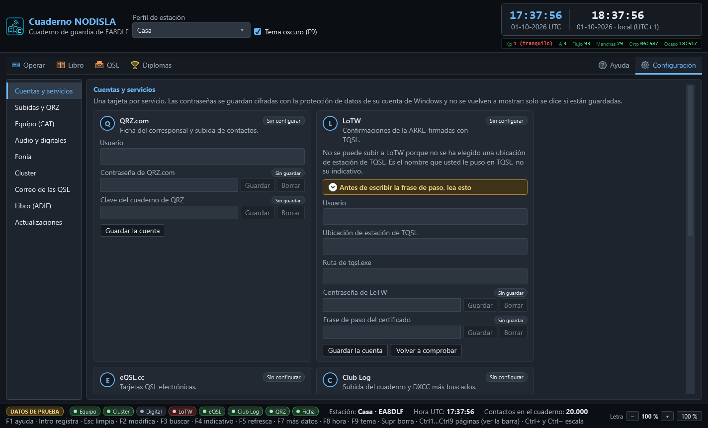
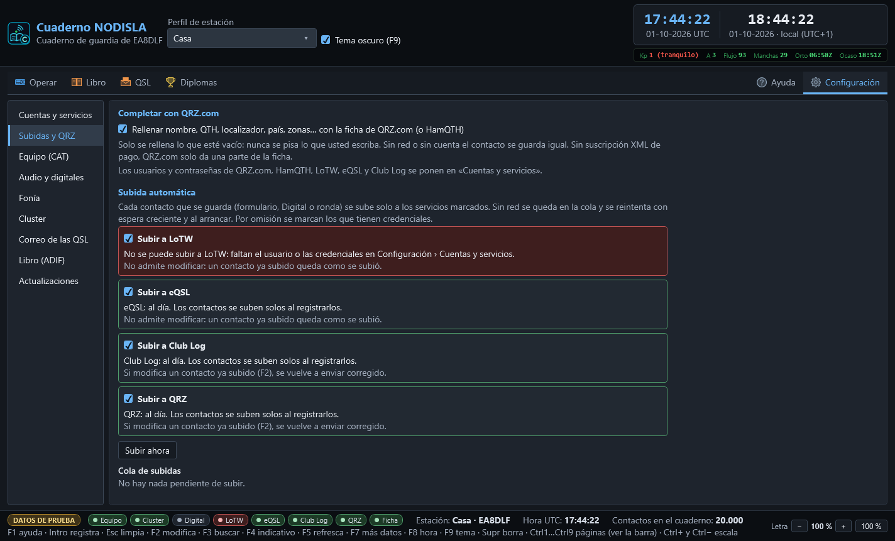
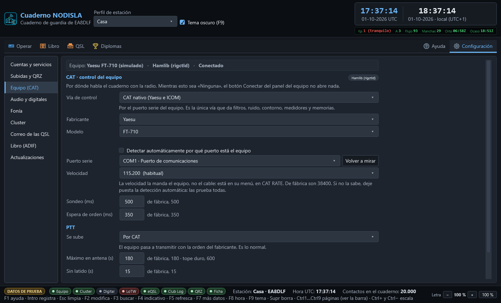
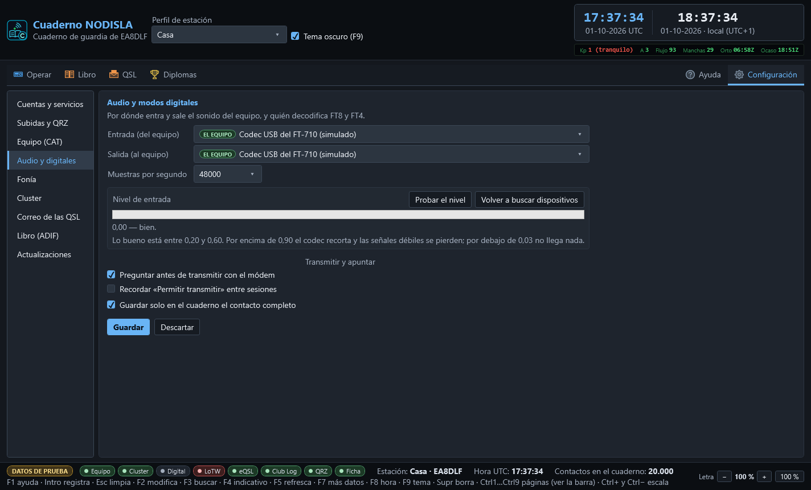
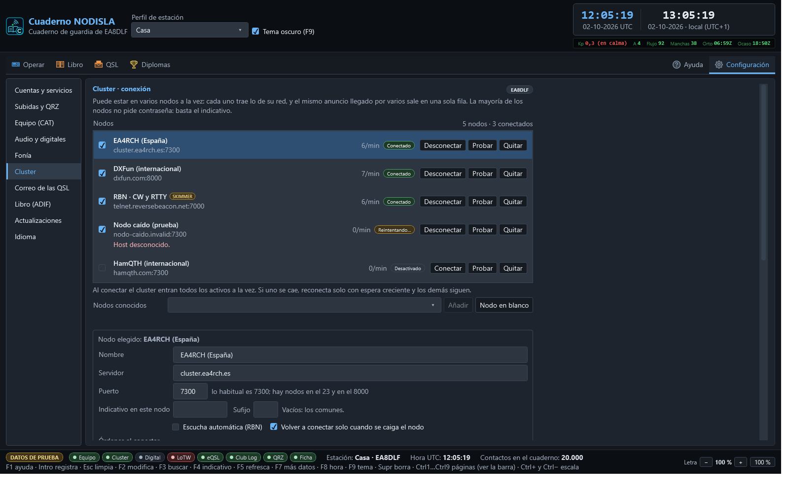
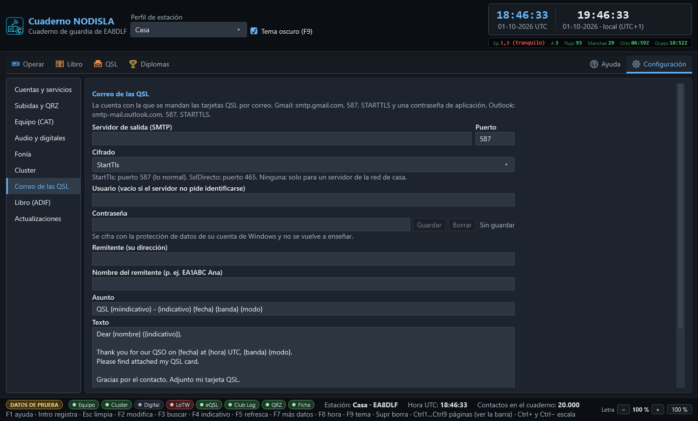

# Configuración

Todo lo que se configura una vez y se olvida, y lo que hace falta para diagnosticar cuando algo
no va. Lo que se mira mientras se opera —el estado de las conexiones— se queda en **Operar**;
aquí está el resto.

Se abre con la entrada **Configuración**, a la derecha del todo de la barra (o con `Ctrl` `6`).
Va por apartados, con la lista a la izquierda:

| Apartado | Qué hay |
|---|---|
| **Cuentas y servicios** | Una tarjeta por servicio: QRZ.com, LoTW, eQSL.cc, Club Log, HamQTH, el cluster y el correo (SMTP) |
| **Subidas y QRZ** | Completar con la ficha de QRZ.com y la subida automática, con su cola |
| **Equipo (CAT)** | Por dónde habla el cuaderno con la radio y el PTT |
| **Audio y digitales** | Entrada y salida de sonido del equipo y cómo transmite y apunta el módem |
| **Fonía** | Altavoces, micrófono y PTT de fonía por el PC |
| **Cluster** | Los nodos (varios a la vez), su estado en vivo, el guion de arranque de cada uno y la consola cruda |
| **Correo de las QSL** | La cuenta con la que se mandan las tarjetas |
| **Libro (ADIF)** | Importar y exportar el cuaderno |
| **Actualizaciones** | Versión instalada, buscar versiones nuevas al arrancar o a mano |
| **Servidor para otros programas** | Servidores rigctld y TCI para que WSJT-X, JTDX, GridTracker… usen la radio a través del Cuaderno |

## Cuentas y servicios

Cada servicio es una **tarjeta** con todo lo suyo junto: el usuario y los demás datos de la
cuenta, sus contraseñas o claves, y una pastilla arriba a la derecha con su estado —verde
**Configurada**, ámbar **Incompleta** (o «Falta TQSL», «Falta la contraseña»), gris **Sin
configurar**—.

- **QRZ.com** — usuario, contraseña (para la ficha del corresponsal) y la *Clave del cuaderno de
  QRZ* (para subir contactos; la da QRZ en *Logbook → Settings → API*).
- **LoTW** — usuario, **ubicación de estación de TQSL** (el nombre que le puso en TQSL, no su
  indicativo), ruta de `tqsl.exe` si no está en su sitio, contraseña de LoTW y frase de paso del
  certificado. La tarjeta dice con toda claridad **por qué** no se puede subir cuando falta algo
  —el certificado, la frase de paso o `tqsl.exe`— y tiene **Volver a comprobar**. Antes de
  escribir la frase de paso, lea el aviso ámbar de la propia tarjeta.
- **eQSL.cc** — usuario, apodo del QTH (si tiene varios) y contraseña.
- **Club Log** — correo de la cuenta, indicativo del cuaderno, contraseña y clave de API.
- **HamQTH** — usuario y contraseña; hace de reserva cuando QRZ.com no contesta.
- **Cluster de DX** — su estado: cuántos nodos hay y cuántos están conectados, cuáles están
  activos y con qué indicativo se entra; **Configurar…** lleva al apartado Cluster.
- **Correo (SMTP)** — su estado, **Probar la conexión** (se identifica sin mandar nada) y
  **Configurar…**, que lleva al apartado Correo de las QSL.

Un usuario vacío es el indicativo del perfil de estación, que es lo normal. Los datos de la
cuenta se guardan con **Guardar la cuenta**; cada contraseña, con su propio **Guardar**.

Las contraseñas se guardan **cifradas con la protección de datos de la cuenta de Windows
(DPAPI)**. Una vez guardadas, el campo no se vuelve a rellenar: solo dice si hay algo guardado o
no. Un secreto que se repinta en pantalla es un secreto que alguien puede leer por encima del
hombro.

## Subidas y QRZ

### Completar con QRZ.com

La casilla **Rellenar nombre, QTH, localizador… con la ficha de QRZ.com** está marcada de
fábrica. Hace falta la contraseña de QRZ.com (tarjeta QRZ.com); con la de **HamQTH** guardada,
HamQTH hace de reserva. Solo se rellena lo vacío; nunca se pisa lo que usted escriba.

### Subida automática

Una casilla por servicio: **LoTW**, **eQSL**, **Club Log** y **QRZ** (el cuaderno de QRZ.com, con
la *Clave del cuaderno de QRZ*). De fábrica se marcan solas las que tienen credenciales
guardadas; si toca una casilla, se queda como usted la deje.

Todo contacto que se guarda (formulario, Digital o ronda) entra en la **cola de subidas**. La
cola se guarda en disco: sin red, o si el servicio falla, se reintenta sola con espera creciente
(1, 2, 4… minutos, hasta una hora) y otra vez al arrancar el programa. Después de 8 intentos
fallidos el contacto queda marcado como fallido y la pastilla se pone roja; **Subir ahora** lo
reintenta todo en el momento.

Debajo de cada servicio se lee su estado con palabras y si admite correcciones: Club Log y QRZ
reciben de nuevo un contacto modificado con F2; **LoTW y eQSL no admiten modificar** lo ya
subido. LoTW necesita **TQSL instalado** con su certificado y la ubicación de estación: si falta,
la pastilla lo dice y no se reintenta en bucle; en cuanto se arregla, sale todo solo.

La importación de un ADIF **no** sube nada: solo se suben los contactos que se registran o se
modifican en el programa.

**La primera vez:**

1. En **Cuentas y servicios**, tarjeta QRZ.com: guarde la contraseña y, si quiere subir al
   cuaderno de QRZ, la *Clave del cuaderno de QRZ*.
2. Tarjeta LoTW: instale TQSL con su certificado, guarde la contraseña de LoTW, escriba la
   ubicación de estación de TQSL y pulse **Guardar la cuenta**.
3. Tarjetas eQSL.cc y Club Log: contraseñas, clave de API de Club Log y el correo de la cuenta.
4. Mire que las pastillas de las tarjetas, y las de la barra de estado, se pongan verdes.

## Equipo (CAT)

Aquí se elige **por dónde** habla el cuaderno con la radio. Si esto se queda en «Ninguna», el
botón «Conectar» del panel del equipo no abre nada.

- **Vía de control**: **CAT nativo (Yaesu e ICOM)** por puerto serie, `rigctld` de Hamlib por
  TCP, u OmniRig.
- **Fabricante** y **Modelo** (CAT nativo): el FT-710 y los demás Yaesu e ICOM de
  [Equipos](15-equipos.md), o la detección automática. Los que no son el FT-710 salen marcados
  «según manual, sin probar con radio». En ICOM, la **dirección CI-V** si se cambió en la radio.
- **Puerto y velocidad** (CAT nativo) — con detección automática si no se sabe el puerto: prueba
  primero por donde estaba y, si no contesta, recorre todos los puertos preguntando
  identificación. **La detección es por lo que contesta el equipo, nunca por el número de
  puerto**, porque puede haber otro aparato hablando también por serie en la misma máquina. La
  velocidad la manda el equipo, no el cable — en el FT-710, MENU › OPERATION SETTING › GENERAL ›
  `CAT-1 RATE`; use el puerto **Enhanced** a **115.200**.
- **Máquina y puerto TCP** (rigctld) — normalmente `127.0.0.1` y el `4532` de siempre, con
  `rigctld` ya arrancado de antemano.
- **Número de equipo** (OmniRig) — OmniRig maneja dos radios, la 1 y la 2; aquí se dice cuál
  sigue el cuaderno.
- **PTT**: por dónde se sube — CAT, un puerto serie aparte con RTS/DTR, o VOX —, el **tiempo
  máximo en antena** (de fábrica 180 s, tope duro 600 s) y el **tiempo sin latido** tras el que
  se suelta solo. El vigilante de PTT baja el PTT pase lo que pase: al agotarse el tiempo, si
  quien transmite deja de dar señales de vida, si salta un fallo, o al cerrar el programa. **Un
  PTT pegado quema la etapa final**, y esta es la única pieza del programa pensada explícitamente
  para que eso nunca pueda pasar.

El botón **«Probar»** abre la conexión, lee identificación, frecuencia y modo, y cierra —
**nunca transmite**. «Aplicar» guarda y cambia la vía sin cerrar el programa; «Descartar» vuelve
a lo guardado.

## Audio y digitales

Por dónde entra y sale el sonido del equipo. Todos los modos digitales los hace el **módem
propio** del programa (ver [Digital](03-digital.md)); no hace falta ningún otro programa. Los dispositivos de **entrada** y
**salida** de audio se eligen de la lista de dispositivos de Windows; el que corresponde al
codec USB del equipo sale marcado **«EL EQUIPO»** y el primero de la lista, emparejado por el
identificador de contenedor USB, no por el nombre — así no hay que adivinar cuál es entre veinte
dispositivos con nombres parecidos. **Probar el nivel** es la única acción de esta pantalla que
abre de verdad la tarjeta de sonido; se cierra sola al parar la prueba o al salir.

Al final, el apartado **Telegrafía (CW)**: tono por omisión, ancho del filtro, sensibilidad,
velocidades mínima y máxima y cuántas señales se leen a la vez. Ver
[Telegrafía (CW)](17-cw.md#ajustes).

## Fonía

Altavoces, micrófono y el PTT de fonía por el PC. Ver [Fonía por el PC](12-fonia.md).

## Cluster

El cuaderno puede estar en **varios nodos a la vez**. Arriba está la **lista de nodos**, con su
estado **en vivo**:

- La casilla de la izquierda es **Activo**: los activos entran todos a la vez al pulsar
  **Conectar** en el panel del cluster; uno sin marcar se queda en la lista sin conectar.
- La pastilla dice cómo va: **Conectado** (verde), **Conectando** o **Reintentando** (ámbar),
  **Conexión fallida** (rojo, por ejemplo un indicativo rechazado, que no se reintenta) o **Desactivado**.
  Debajo, en rojo, el **motivo** del último fallo. Al lado, cuántos **anuncios por minuto** trae.
- Cada fila tiene sus botones: **Conectar/Desconectar** ese nodo sin tocar los demás,
  **Probar** (abre el puerto y lee el saludo del nodo **sin entrar con su indicativo**) y
  **Quitar**.
- **SKIMMER** marca los nodos de escucha automática (Reverse Beacon Network): todo lo que traen
  sale como de máquina y se puede esconder en el panel del cluster.

Para **añadir** un nodo, elíjalo en **Nodos conocidos** y pulse **Añadir**, o pulse **Nodo en
blanco** para escribir uno que no esté. La lista trae nodos DXSpider, AR-Cluster y CC Cluster de
Europa y América y las dos redes de escucha automática de la RBN (telegrafía/RTTY en el puerto
7000 y FT8/FT4 en el 7001). Los que no contestaban cuando se comprobó la lista salen marcados
**«sin comprobar»**.

Al elegir un nodo de la lista se edita debajo: nombre, servidor, puerto, **indicativo y sufijo
propios** (vacíos, los comunes; útil para entrar como `EA8DLF-2` en un segundo nodo de la misma
red), escucha automática, reconexión, el **guion de arranque** — las órdenes que se mandan nada
más entrar, una por línea, con `<CALLSIGN>` y `<PASSWORD>` como comodines (los `set/` y
`filter` de ese nodo) — y su **contraseña**, si la pide: cada nodo tiene la suya, cifrada igual
que las demás credenciales.

Más abajo, lo **común**: el indicativo con el que se entra (vacío, el del perfil de estación
activo) y el sufijo; cómo se juntan los **anuncios repetidos** (tolerancia en kHz, 1 por omisión,
y ventana en minutos, 10 por omisión); y los tiempos de reconexión — la espera crece en cada
intento hasta el tope — y de silencio máximo antes de dar la conexión por muerta.

**Aplicar** pone la lista en marcha sin cerrar el programa: los nodos que no han
cambiado **siguen conectados**, los cambiados se reconectan y los quitados se cierran (y su
contraseña se borra del almacén).

El nodo que se tenía configurado antes de poder tener varios **pasa a ser el primero de la
lista**, con todo lo que tenía, también la contraseña guardada.

La **consola cruda** — todo lo que mandan los nodos y no es un anuncio — vive en este mismo
apartado, no en Operar. Con varios nodos cada línea lleva delante el nombre de su nodo, y el
desplegable junto a la orden dice **a qué nodo se manda**: las órdenes y los spots propios
(`DX 14025 …`) van **solo a ese nodo**, nunca a todos, para que no salgan repetidos en toda la
red.

## Correo de las QSL

La cuenta con la que se mandan las tarjetas QSL por correo: servidor SMTP, puerto, cifrado
(*StartTls* en el 587, *SslDirecto* en el 465), usuario, contraseña (cifrada, con «Guardar»),
remitente, asunto y texto con variables, y si la tarjeta va en JPG o PNG. **Probar la conexión**
se identifica en el servidor sin mandar nada. Detalles en
[Tarjeta QSL propia](13-tarjeta-qsl.md#lo-que-hay-que-configurar-una-vez).

## Libro (ADIF)

Cuántos contactos hay, y los botones **«Importar ADIF…»** y **«Exportar ADIF…»** para traer o
sacar el cuaderno completo. Cada importación deja su parte a la vista, con las confirmaciones
rescatadas al fundir duplicados destacadas aparte — la misma pantalla que aparece la primera vez
con el cuaderno vacío, disponible aquí en cualquier momento.

## Actualizaciones

La **versión instalada**, la casilla **Buscar versiones nuevas al arrancar** (como mucho una vez
al día) y el botón **Buscar actualizaciones**. Es el mismo aviso que la barra de arriba y que
**Ayuda › Buscar actualizaciones**. Ver [Ayuda, actualizaciones y fallos](16-ayuda-actualizaciones-y-fallos.md).

## Servidor para otros programas

Los servidores **rigctld compatible** (puerto 4532) y **TCI** (puerto 40001), apagados de
fábrica y solo para este PC; la red local con su lista de IP; los permisos (cambiar la radio y
**Permitir TX a clientes externos**); los programas conectados en vivo, con **Desconectar**; y
quién pidió transmitir. Ver [Conectar otros programas](20-conectar-otros-programas.md).
