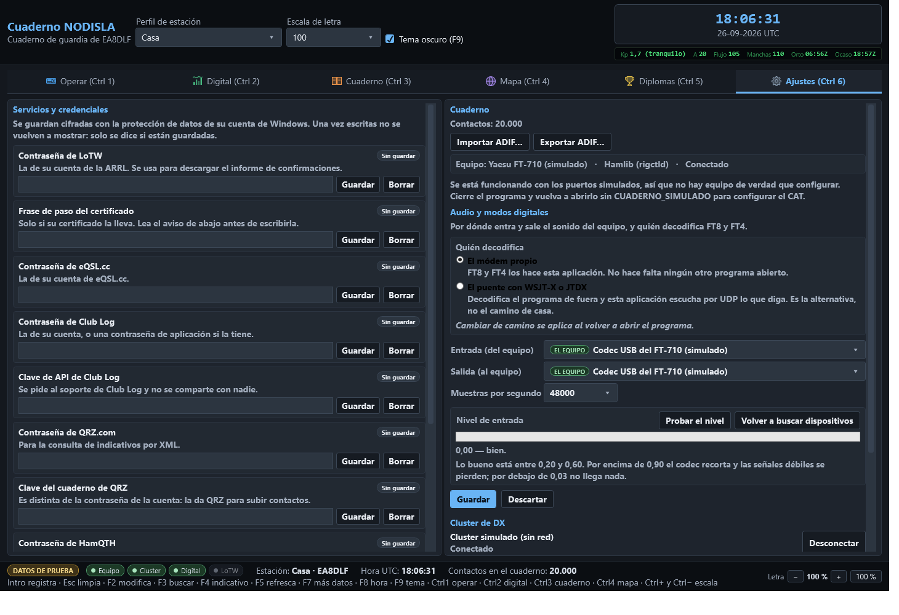

# Ajustes

Todo lo que se configura una vez y se olvida, y lo que hace falta para diagnosticar cuando algo
no va. Lo que se mira mientras se opera —el estado de las conexiones— se queda en la pestaña
**Operar**; aquí está el resto.

## CAT: el equipo

Aquí se elige **por dónde** habla el cuaderno con la radio. Si esto se queda en «Ninguna», el
botón «Conectar» del panel del equipo no abre nada.

- **Vía de control**: CAT nativo por puerto serie, `rigctld` de Hamlib por TCP, u OmniRig.
- **Puerto y velocidad** (CAT nativo) — con detección automática si no se sabe el puerto: prueba
  primero por donde estaba y, si no contesta, recorre todos los puertos preguntando
  identificación. **La detección es por lo que contesta el equipo, nunca por el número de
  puerto**, porque puede haber otro aparato hablando también por serie en la misma máquina. La
  velocidad la manda el equipo, no el cable — está en su menú, en `CAT RATE`.
- **Máquina y puerto TCP** (rigctld) — normalmente `127.0.0.1` y el `4532` de siempre, con
  `rigctld` ya arrancado de antemano.
- **Número de equipo** (OmniRig) — OmniRig maneja dos radios, la 1 y la 2; aquí se dice cuál
  sigue el cuaderno.
- **PTT**: por dónde se sube — CAT, un puerto serie aparte con RTS/DTR, o VOX —, el **tiempo
  máximo en antena** (de fábrica 180 s, tope duro 600 s) y el **tiempo sin latido** tras el que
  se suelta solo. El vigilante de PTT baja el PTT pase lo que pase: al agotarse el tiempo, si
  quien transmite deja de dar señales de vida, si salta un fallo, o al cerrar el programa. **Un
  PTT pegado quema la etapa final**, y esta es la única pieza del programa pensada explícitamente
  para que eso nunca pueda pasar.

El botón **«Probar»** abre la conexión, lee identificación, frecuencia y modo, y cierra —
**nunca transmite**. «Aplicar» guarda y cambia la vía sin cerrar el programa; «Descartar» vuelve
a lo guardado.

## Audio y modos digitales

Por dónde entra y sale el sonido del equipo, y **quién decodifica** FT8 y FT4:

- **El módem propio** — esta aplicación decodifica sin necesitar ningún otro programa abierto.
- **El puente con WSJT-X o JTDX** — decodifica el programa de fuera y el cuaderno escucha por
  UDP lo que diga.

Cambiar de camino se aplica al volver a abrir el programa. Los dispositivos de **entrada** y
**salida** de audio se eligen de la lista de dispositivos de Windows; el que corresponde al
codec USB del equipo sale marcado **«EL EQUIPO»** y el primero de la lista, emparejado por el
identificador de contenedor USB, no por el nombre — así no hay que adivinar cuál es entre veinte
dispositivos con nombres parecidos. **Probar el nivel** es la única acción de esta pantalla que
abre de verdad la tarjeta de sonido; se cierra sola al parar la prueba o al salir.

## Servicios y credenciales

Las contraseñas de LoTW, eQSL, ClubLog, QRZ.com, HamQTH y demás se escriben aquí y se guardan
**cifradas con la protección de datos de la cuenta de Windows (DPAPI)**. Una vez guardadas, el
campo no se vuelve a rellenar: solo dice si hay algo guardado o no. Un secreto que se repinta en
pantalla es un secreto que alguien puede leer por encima del hombro.

Esta pantalla también dice, con toda claridad, **por qué** no se puede subir a LoTW cuando falta
algo — el certificado, la frase de paso, o `tqsl.exe` — en vez de dejar un botón gris sin
explicación.

### Completar con QRZ.com

La casilla **Rellenar nombre, QTH, localizador… con la ficha de QRZ.com** está marcada de
fábrica. Hace falta la **Contraseña de QRZ.com** (arriba) y el **Usuario de QRZ.com**; si el
usuario se deja vacío se usa el indicativo del perfil de estación, que es lo normal. Con la
contraseña de **HamQTH** guardada, HamQTH hace de reserva cuando QRZ no contesta. Solo se rellena
lo vacío; nunca se pisa lo que usted escriba.

### Cuentas de los servicios

Aquí van los **usuarios**, que no son secretos (las contraseñas y claves van arriba, cifradas):
usuario de QRZ.com y de HamQTH, usuario de LoTW, **ubicación de estación de TQSL** (el nombre
que le puso en TQSL, no su indicativo), ruta de `tqsl.exe` si no está en su sitio, usuario y
apodo de eQSL, y correo e indicativo de Club Log. Un usuario vacío es el indicativo del perfil.
Pulse **Guardar cuentas**: vale en el acto, sin reiniciar.

### Subida automática

Una casilla por servicio: **LoTW**, **eQSL**, **Club Log** y **QRZ** (el cuaderno de QRZ.com, con
la *Clave del cuaderno de QRZ*). De fábrica se marcan solas las que tienen credenciales
guardadas; si toca una casilla, se queda como usted la deje.

Todo contacto que se guarda (formulario, Digital o ronda) entra en la **cola de subidas**. La
cola se guarda en disco: sin red, o si el servicio falla, se reintenta sola con espera creciente
(1, 2, 4… minutos, hasta una hora) y otra vez al arrancar el programa. Después de 8 intentos
fallidos el contacto queda marcado como fallido y la pastilla se pone roja; **Subir ahora** lo
reintenta todo en el momento.

Debajo de cada servicio se lee su estado con palabras y si admite correcciones: Club Log y QRZ
reciben de nuevo un contacto modificado con F2; **LoTW y eQSL no admiten modificar** lo ya
subido. LoTW necesita **TQSL instalado** con su certificado y la ubicación de estación: si falta,
la pastilla lo dice y no se reintenta en bucle; en cuanto se arregla, sale todo solo.

La importación de un ADIF **no** sube nada: solo se suben los contactos que se registran o se
modifican en el programa.

**La primera vez:**

1. Guarde arriba la contraseña de QRZ.com (ficha) y, si quiere subir al cuaderno de QRZ, la
   *Clave del cuaderno de QRZ* (la da QRZ en *Logbook → Settings → API*).
2. LoTW: instale TQSL con su certificado, guarde la contraseña de LoTW y escriba la ubicación
   de estación de TQSL.
3. eQSL: guarde la contraseña de eQSL.cc. Club Log: guarde contraseña y clave de API y escriba
   el correo de la cuenta.
4. Pulse **Guardar cuentas** y mire que las pastillas se pongan verdes.

### Correo de las QSL

La cuenta con la que se mandan las tarjetas QSL por correo: servidor SMTP, puerto, cifrado
(*StartTls* en el 587, *SslDirecto* en el 465), usuario, contraseña (cifrada, con «Guardar»),
remitente, asunto y texto con variables, y si la tarjeta va en JPG o PNG. **Probar la conexión**
se identifica en el servidor sin mandar nada. Detalles en
[Tarjeta QSL propia](13-tarjeta-qsl.md#lo-que-hay-que-configurar-una-vez).

## Cluster de DX

El nodo al que se conecta, el indicativo con el que se entra (con sufijo si hace falta tener dos
sesiones abiertas), la contraseña — cifrada igual que las demás credenciales — y el **guion de
arranque**: las órdenes que se mandan nada más conectar, una por línea, con `<CALLSIGN>` y
`<PASSWORD>` como comodines. Los tiempos de reconexión y de silencio máximo antes de dar la
conexión por muerta también se ajustan aquí. La **consola cruda** del nodo — todo lo que manda y
no es un anuncio — vive en esta misma pantalla, no en Operar: mientras se opera se leen los
anuncios, no los `set/` del nodo; la consola es para configurar y para diagnosticar.

## El cuaderno y el ADIF

Cuántos contactos hay, y los botones **«Importar ADIF…»** y **«Exportar ADIF…»** para traer o
sacar el cuaderno completo. Cada importación deja su parte a la vista, con las confirmaciones
rescatadas al fundir duplicados destacadas aparte — la misma pantalla que aparece la primera vez
con el cuaderno vacío, disponible aquí en cualquier momento.
