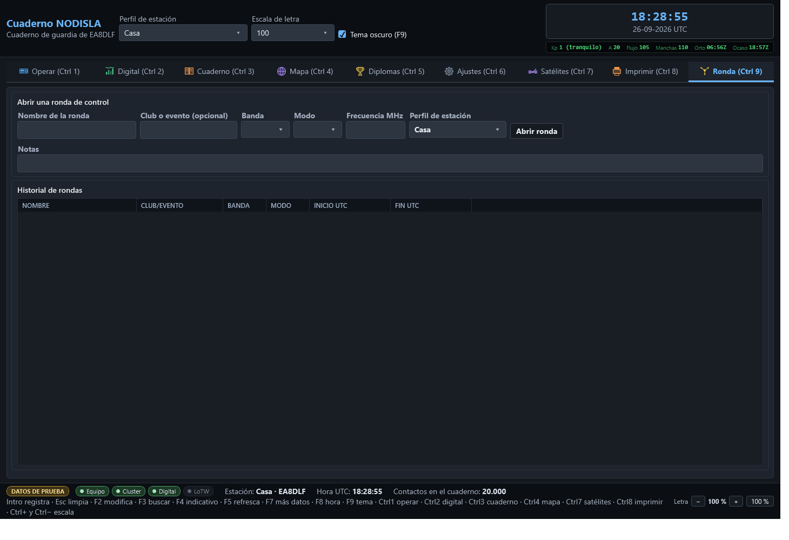

# Ronda de control

La pestaña **Ronda (Ctrl 9)** es para las rondas de control (*net control*): una red de
radioaficionados con un director, una lista de participantes que van entrando, y un contacto
real del cuaderno por cada uno que se confirma.

## Abrir una ronda

Mientras no hay ninguna ronda abierta, la pestaña enseña el formulario de arriba: **nombre de la
ronda**, **club o evento** (opcional), **banda**, **modo**, **frecuencia** y el **perfil de
estación** con el que se va a dirigir. Con «Abrir ronda» empieza la sesión y el formulario se
sustituye por la cabecera de la ronda en curso, con su resumen y el botón «Cerrar ronda».

**Solo puede haber una ronda abierta a la vez.**

## Los participantes

Con la ronda abierta aparece un campo para teclear el **indicativo** y el botón «Añadir a la
ronda» (o `Intro` en el propio campo), que lo suma a la lista con su hora de entrada. Cada fila
de la rejilla se puede editar sobre la marcha:

- **RST TX** y **RST RX** — los informes intercambiados con ese participante.
- **Comentario** — cualquier nota suelta.
- **«Guardar RST/comentario»** — guarda esos cambios sobre la fila sin cerrarla todavía.
- **«Confirmar trabajado»** — convierte al participante en un **contacto real del cuaderno**, con
  la banda, el modo y la frecuencia de la ronda y la hora de entrada de ese participante. La
  columna **TRABAJADO** se marca en cuanto esto ocurre. Si el mismo contacto —mismo indicativo,
  hora, banda y modo— ya estuviera en el cuaderno, el programa lo dice en vez de duplicarlo.
- **«Quitar»** — elimina de la lista al participante seleccionado sin tocar el cuaderno.

## Cerrar la ronda y el historial

**«Cerrar ronda»** termina la sesión y la manda al **historial**, que es lo que se ve en esta
misma pestaña mientras no hay ninguna ronda abierta: nombre, club o evento, banda, modo, inicio
y fin en UTC, cuántos participantes hubo y cuántos se llegaron a confirmar como trabajados.

## Reapertura automática

Si el programa se cierra —o se cae— con una ronda todavía abierta, **la vuelve a abrir sola al
arrancar**, exactamente donde se quedó, con toda su lista de participantes. La pantalla no
distingue si la ronda acaba de abrirse o si venía de antes: es la misma ronda, y no hace falta
recordar cerrarla a mano para no perderla.
