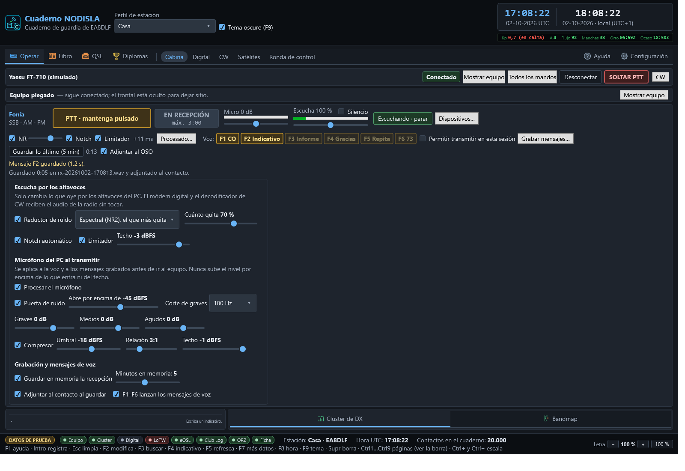
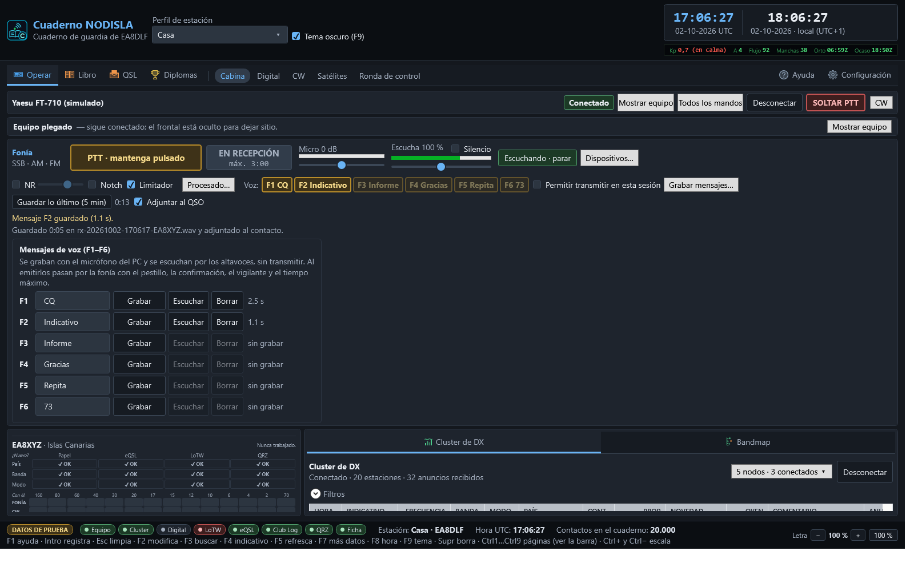

# Fonía por el PC

El panel **Fonía** de **Operar › Cabina** permite trabajar SSB, AM y FM con el ordenador:
la radio se oye por los **altavoces del PC** y se habla por el **micrófono del PC**, con un
botón de PTT en pantalla.

## Dónde está

- Con el frontal del equipo a la vista, el panel va **en columna a la derecha del frontal**, en
  el hueco que queda libre: no quita alto al contacto nuevo ni al cluster.
- Con el frontal plegado («Ocultar equipo»), el panel pasa a una **franja** bajo la barra del
  equipo.

## Escuchar la radio por el PC

Pulse **«Escuchar por el PC»**. El audio que sale del codec USB del FT-710 («Micrófono (USB
Audio Device)») se lleva a los altavoces o auriculares del PC, con poco retraso (del orden de
una décima de segundo).

- El control deslizante de **Escucha** es el volumen (de 0 a 200 %) y la barra verde, lo que
  llega del equipo.
- **Silencio** calla los altavoces sin cerrar la escucha.
- El módem digital puede estar escuchando a la vez: el audio del equipo se comparte, no se lo
  queda nadie.
- Si la radio se apaga o se desenchufa el USB, el panel lo dice («No llega audio del equipo…» o
  «La escucha por el PC se ha cortado») y la escucha se cierra sola; vuelva a pulsar cuando el
  equipo esté otra vez encendido.

## Hablar: el PTT de fonía

- **Mantener pulsado** (por omisión): se transmite mientras el botón está pulsado y se vuelve a
  recepción al soltarlo.
- **Conmutado** (en Configuración › Fonía): un clic empieza y otro clic acaba.
- **Tecla del PTT** (en Configuración › Fonía, por omisión ninguna): F10, F11, F12, Pausa, Bloq Despl, Insert o
  Ctrl derecho. Solo funciona con la ventana del programa activa y **nunca** con el cursor en un
  campo de texto, para que escribir un indicativo no le saque al aire.

Mientras transmite, el cartel dice **EN EL AIRE** con el tiempo que lleva y el máximo, la barra
**Micro** enseña su nivel (si pone **SATURA**, baje la ganancia) y los altavoces del PC se
callan solos para que el micrófono no los oiga.

### Cuándo se suelta solo

El PTT de fonía va siempre por el mismo vigilante que el de los modos digitales. Se suelta:

- al soltar el botón o la tecla (o al segundo clic, en conmutado);
- con **SOLTAR PTT** de la barra del equipo;
- al llegar al **tiempo máximo** de la pasada (3 minutos por omisión; se cambia en Configuración › Fonía, de
  10 a 600 segundos; manda el menor entre este y el del vigilante);
- si el programa **pierde el foco** (otra ventana pasa delante) o se cambia de página;
- si el audio del micrófono o del equipo se queda parado más de dos segundos;
- si el equipo pasa a un modo de datos, se pierde la comunicación con él o el programa se
  cierra.

### Cuándo no se puede

El botón se apaga, y dice por qué, cuando:

- el equipo no está conectado;
- el equipo está en **DATA, CW, RTTY** u otro modo que no es de voz (para no mezclarse con el
  módem);
- no están elegidos el micrófono del PC y la salida hacia el equipo;
- ya hay otra transmisión en el aire (por ejemplo, del módem).

## Limpiar la escucha: reductor, notch y limitador

Bajo el PTT hay una segunda fila. **NR**, **Notch** y **Limitador** se encienden y apagan en
vivo, mientras escucha; «Procesado…» abre todos los ajustes (los mismos de Configuración ›
Fonía).

- **Reductor de ruido (NR)**: quita el soplido de fondo. Hay dos:
  - **Espectral (NR2)**, el que más quita. Añade unos **11 ms** de retraso, que el panel enseña
    al lado («+11 ms»). Medido con voz y ruido: la relación señal-ruido mejora unos **8 dB** y el
    ruido en las pausas baja unos **28 dB** con el nivel al 100 %.
  - **Adaptativo (NR1)**, más suave; va bien con tonos y vocales sostenidas y **no retrasa nada**.
  - **Cuánto quita** gradúa el espectral: al 30 % apenas toca la voz; al 100 % quita todo lo que
    puede.
- **Notch automático**: busca y quita las **portadoras y pitidos fijos** (alguien afinando
  encima). Una portadora de 1 kHz baja más de **40 dB**; la voz pasa. No retrasa.
- **Limitador**: ningún golpe de audio pasa del **techo** (−3 dBFS por omisión, de −20 a −1):
  protege altavoces y oídos de los chasquidos de estática.

Todo esto **solo cambia lo que suena por los altavoces del PC**. El módem digital y el
decodificador de CW leen el audio de la radio por su cuenta y lo reciben **sin tocar**.

## Procesar el micrófono

En «Procesado…», **Procesar el micrófono** (apagado por omisión) pasa la voz por:

- una **puerta de ruido**, que baja el fondo (ventilador, teclado) cuando no habla;
- un **corte de graves** (100 Hz por omisión) y un ecualizador de **graves, medios y agudos**;
- un **compresor** que iguala la voz bajando los picos;
- y un **techo** final (−1 dBFS como mucho; no se puede subir más).

**Nunca sube el nivel**: lo que sale hacia el equipo no pasa de lo que entra del micrófono (con
su ganancia) ni del techo, aunque realce una banda del ecualizador. Ajuste el nivel con la
**ganancia del micro** y la ALC de la radio, como siempre.

## Mensajes de voz (voice keyer)

Seis mensajes grabados con el micrófono del PC —CQ, indicativo, informe…— que salen al aire
con un botón o con **F1 a F6**.

- **Grabar mensajes…** abre la lista: **Grabar** empieza, **Terminar** acaba (como mucho
  60 s; el silencio del principio y del final se recorta solo). **Escuchar** lo suena por los
  **altavoces del PC**, sin transmitir. El nombre se cambia escribiendo encima.
- Se guardan en la carpeta de datos, en `voz\mensaje-1.wav` … `mensaje-6.wav`.
- **Para transmitirlos** tienen que cumplirse, por este orden:
  1. el pestillo **«Permitir transmitir en esta sesión»** marcado (es el mismo del módem y de la
     CW, y no se guarda: cada vez que abre el programa está quitado);
  2. lo mismo que el PTT de fonía: equipo conectado, modo de voz, micrófono y salida elegidos;
  3. la **pregunta de confirmación**, si no la ha quitado;
  4. que el mensaje **quepa en el tiempo máximo** de la pasada.
- Sale por el mismo camino que su voz: el **vigilante del PTT**, el tiempo máximo, el procesado
  del micrófono y su techo. Al acabar el mensaje, el PTT **baja solo**.
- Se corta con **Parar**, con **Esc**, pulsando el **PTT**, con **SOLTAR PTT**, quitando el
  pestillo, moviendo el **dial** o cambiando a un modo que no es de voz.
- **F1–F6** solo lanzan mensajes con el panel de fonía a la vista, en modo de voz, si la tecla
  tiene mensaje y el cursor no está en un campo de texto; si no, F1 sigue abriendo la ayuda. Se
  puede desactivar en «Procesado…».

## Grabar lo que acaba de pasar

Mientras la escucha por el PC está abierta, el programa guarda **en memoria** los últimos
minutos de lo que llega de la radio (5 por omisión, de 1 a 10; el contador al lado del botón
dice cuánto hay). Nada se escribe en disco hasta que lo pide.

- **Guardar lo último** escribe un WAV en la carpeta de datos, en `audio\`, con la fecha y el
  indicativo del contacto: `rx-20261002-183005-EA8XYZ.wav`. Se guarda el audio **tal como
  llega** de la radio, sin volumen ni reductor.
- Con **Adjuntar al QSO** marcado, el audio se **adjunta al contacto** que está escribiendo (o
  modificando) y se guarda con él al registrarlo.

En el contacto aparece **Audio** con **Escuchar** (suena por los altavoces del PC) y **Quitar**
(lo desliga del contacto; el fichero se queda en la carpeta). Al abrir un contacto del Libro
para modificarlo, si tiene audio, se escucha igual. El audio es del cuaderno: no va al ADIF.

## Dispositivos

«Dispositivos…» abre los cuatro selectores (también están en **Configuración › Fonía**):

| Selector | Qué poner |
|---|---|
| Micrófono del PC | el micro o los auriculares con micro del PC |
| Altavoces del PC | los altavoces o auriculares del PC |
| Entrada del equipo | «Micrófono (USB Audio Device)», marcado «del equipo» |
| Salida al equipo | «Altavoces (USB Audio Device)», marcado «del equipo» |

Los del equipo se reconocen solos. Si algo está cruzado —el micro es la entrada del equipo, o los
altavoces son la salida al equipo— el panel avisa en naranja.

## En la radio: la fuente de modulación

Para que la voz del PC salga al aire, el FT-710 tiene que tomar el audio de **USB** y no del
micrófono de la radio en los modos de voz. Mírelo en el menú de la radio, en la parte de
**MODE SSB** (y en AM/FM si los va a usar): la fuente de modulación tiene que estar en **USB**
(«REAR»/«USB» según la pantalla). El programa **no cambia menús de la radio**.

El programa **lee** (sin escribir nada) el menú EX010113 al conectar en USB o LSB, o al pulsar
«Comprobar la radio», y avisa si no vale «1». Ese índice sale del mapa leído del propio equipo y
**está sin confirmar con el manual**: si el aviso no cuadra con lo que enseña la radio, corrija
el índice o el valor en Configuración › Fonía, o desmarque la comprobación.

Ajuste también en la radio el nivel de entrada USB (USB MOD GAIN o equivalente) para que la ALC
apenas se mueva con la ganancia del micro a 0 dB.
