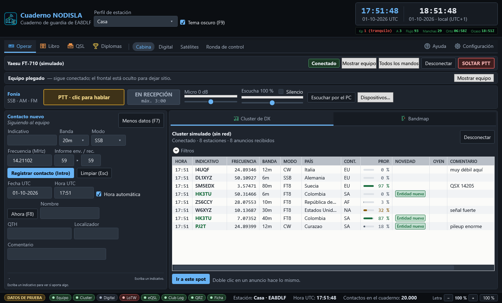
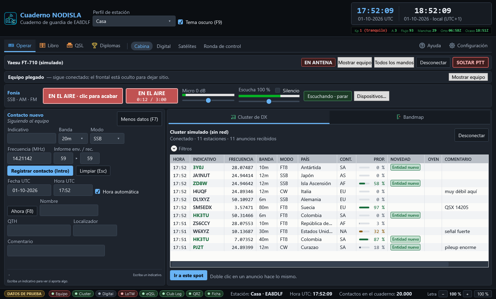
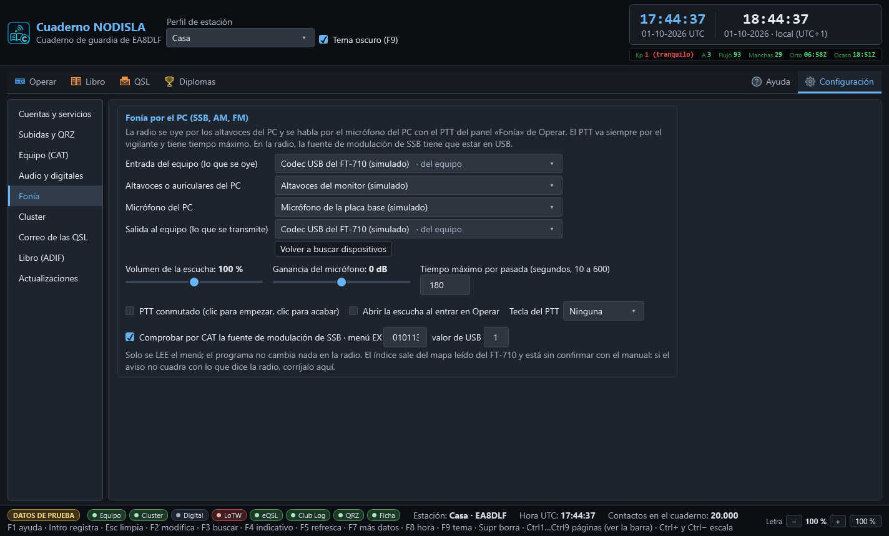

# Fonía por el PC

El panel **Fonía** de **Operar › Cabina** permite trabajar SSB, AM y FM con el ordenador:
la radio se oye por los **altavoces del PC** y se habla por el **micrófono del PC**, con un
botón de PTT en pantalla.

## Dónde está

- Con el frontal del equipo a la vista, el panel va **en columna a la derecha del frontal**, en
  el hueco que queda libre: no quita alto al contacto nuevo ni al cluster.
- Con el frontal plegado («Ocultar equipo»), el panel pasa a una **franja** bajo la barra del
  equipo.

## Escuchar la radio por el PC

Pulse **«Escuchar por el PC»**. El audio que sale del codec USB del FT-710 («Micrófono (USB
Audio Device)») se lleva a los altavoces o auriculares del PC, con poco retraso (del orden de
una décima de segundo).

- El control deslizante de **Escucha** es el volumen (de 0 a 200 %) y la barra verde, lo que
  llega del equipo.
- **Silencio** calla los altavoces sin cerrar la escucha.
- El módem digital puede estar escuchando a la vez: el audio del equipo se comparte, no se lo
  queda nadie.
- Si la radio se apaga o se desenchufa el USB, el panel lo dice («No llega audio del equipo…» o
  «La escucha por el PC se ha cortado») y la escucha se cierra sola; vuelva a pulsar cuando el
  equipo esté otra vez encendido.

## Hablar: el PTT de fonía

- **Mantener pulsado** (por omisión): se transmite mientras el botón está pulsado y se vuelve a
  recepción al soltarlo.
- **Conmutado** (en Configuración › Fonía): un clic empieza y otro clic acaba.
- **Tecla del PTT** (en Configuración › Fonía, por omisión ninguna): F10, F11, F12, Pausa, Bloq Despl, Insert o
  Ctrl derecho. Solo funciona con la ventana del programa activa y **nunca** con el cursor en un
  campo de texto, para que escribir un indicativo no le saque al aire.

Mientras transmite, el cartel dice **EN EL AIRE** con el tiempo que lleva y el máximo, la barra
**Micro** enseña su nivel (si pone **SATURA**, baje la ganancia) y los altavoces del PC se
callan solos para que el micrófono no los oiga.

### Cuándo se suelta solo

El PTT de fonía va siempre por el mismo vigilante que el de los modos digitales. Se suelta:

- al soltar el botón o la tecla (o al segundo clic, en conmutado);
- con **SOLTAR PTT** de la barra del equipo;
- al llegar al **tiempo máximo** de la pasada (3 minutos por omisión; se cambia en Configuración › Fonía, de
  10 a 600 segundos; manda el menor entre este y el del vigilante);
- si el programa **pierde el foco** (otra ventana pasa delante) o se cambia de página;
- si el audio del micrófono o del equipo se queda parado más de dos segundos;
- si el equipo pasa a un modo de datos, se pierde la comunicación con él o el programa se
  cierra.

### Cuándo no se puede

El botón se apaga, y dice por qué, cuando:

- el equipo no está conectado;
- el equipo está en **DATA, CW, RTTY** u otro modo que no es de voz (para no mezclarse con el
  módem);
- no están elegidos el micrófono del PC y la salida hacia el equipo;
- ya hay otra transmisión en el aire (por ejemplo, del módem).

## Dispositivos

«Dispositivos…» abre los cuatro selectores (también están en **Configuración › Fonía**):

| Selector | Qué poner |
|---|---|
| Micrófono del PC | el micro o los auriculares con micro del PC |
| Altavoces del PC | los altavoces o auriculares del PC |
| Entrada del equipo | «Micrófono (USB Audio Device)», marcado «del equipo» |
| Salida al equipo | «Altavoces (USB Audio Device)», marcado «del equipo» |

Los del equipo se reconocen solos. Si algo está cruzado —el micro es la entrada del equipo, o los
altavoces son la salida al equipo— el panel avisa en naranja.

## En la radio: la fuente de modulación

Para que la voz del PC salga al aire, el FT-710 tiene que tomar el audio de **USB** y no del
micrófono de la radio en los modos de voz. Mírelo en el menú de la radio, en la parte de
**MODE SSB** (y en AM/FM si los va a usar): la fuente de modulación tiene que estar en **USB**
(«REAR»/«USB» según la pantalla). El programa **no cambia menús de la radio**.

El programa **lee** (sin escribir nada) el menú EX010113 al conectar en USB o LSB, o al pulsar
«Comprobar la radio», y avisa si no vale «1». Ese índice sale del mapa leído del propio equipo y
**está sin confirmar con el manual**: si el aviso no cuadra con lo que enseña la radio, corrija
el índice o el valor en Configuración › Fonía, o desmarque la comprobación.

Ajuste también en la radio el nivel de entrada USB (USB MOD GAIN o equivalente) para que la ALC
apenas se mueva con la ganancia del micro a 0 dB.
