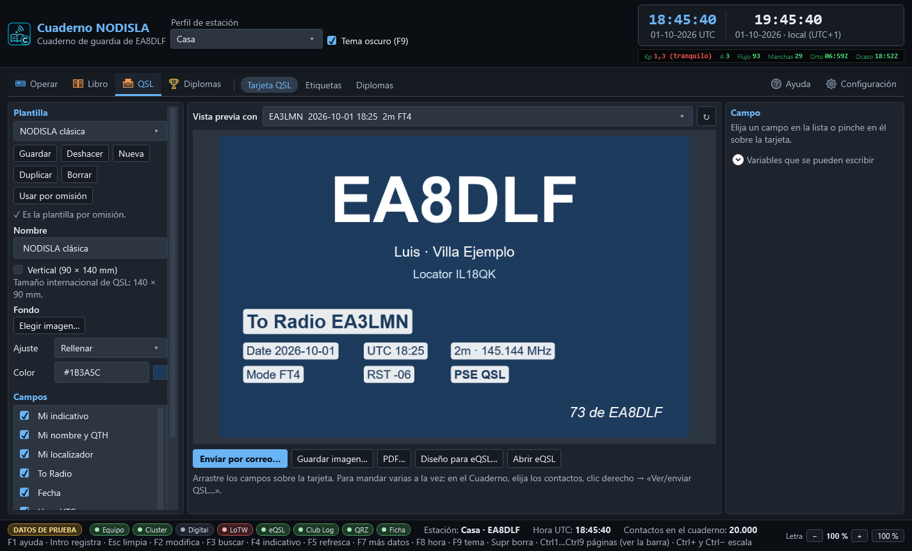
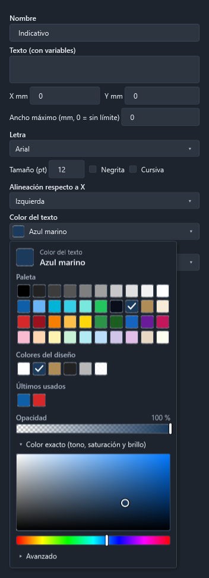

# Tarjeta QSL propia: diseñarla y enviarla por correo

La página **QSL › Tarjeta QSL** (`Ctrl` `8`) es el editor de su tarjeta. Desde ahí, desde el
Cuaderno o desde la ficha de un contacto se genera la tarjeta de cualquier QSO como **imagen**
(JPG/PNG) o **PDF** y se **manda por correo** al corresponsal sin salir del programa.

## El editor

- **Plantilla** — puede tener varias (una para HF, otra para una activación…). **Guardar**,
  **Deshacer** (vuelve a lo guardado), **Nueva**, **Duplicar**, **Borrar** y **Usar por
  omisión**: la de omisión es la que sale al abrir el envío. Se guardan en la carpeta de datos
  del programa, en `qsl\disenos\` (un JSON por plantilla y su imagen de fondo).
- **Tamaño** — 140 × 90 mm, el internacional de QSL. **Vertical** la pone en 90 × 140 y recoloca
  los campos en proporción.
- **Fondo** — **Elegir imagen…** (JPG, PNG, BMP, GIF o TIFF: su foto, su logo). La imagen **se
  copia** a la carpeta de la plantilla, así que borrar o mover la original no deja la tarjeta sin
  fondo. **Ajuste**: *Rellenar* (cubre la tarjeta y recorta lo que sobre), *Encajar* (se ve
  entera; lo que falte queda del color de fondo) o *Estirar*. **Color** es el color liso de
  debajo; se elige en la paleta (vea [Elegir un color](#elegir-un-color)).
- **Campos** — cada texto de la tarjeta: mi indicativo (grande), mi nombre y QTH, mi localizador,
  «To Radio», fecha, hora UTC, banda/frecuencia, modo, RST, «PSE/TNX QSL» y «73». **Se mueven
  arrastrándolos sobre la tarjeta**; para afinar, X/Y en milímetros. La casilla de la lista los
  enciende o apaga. **Añadir texto** pone uno libre.
- **El campo elegido** (a la derecha): texto, letra (cualquier tipografía instalada), tamaño en
  puntos, negrita, cursiva, alineación respecto a X (izquierda, centro, derecha), **color del
  texto** y **recuadro detrás** (por ejemplo un blanco casi opaco, para que se lea sobre una
  foto; *Sin recuadro* lo quita).
- **Vista previa con** — un contacto de verdad del cuaderno (los últimos 40), o ninguno para ver
  solo sus datos.

La tarjeta del centro **es la imagen de verdad**: la misma rutina la dibuja para el correo
(200 ppp) y para el PDF (300 ppp). Lo que se ve es lo que recibe el corresponsal.

En una pantalla pequeña (1366 × 768) cabe igual: las columnas laterales se desplazan.

### Elegir un color

Los colores (del texto, del recuadro, del fondo) se eligen **mirando, no escribiendo códigos**.
El botón enseña la muestra y el nombre del color («Azul marino», «Blanco al 90 %»); al pulsarlo
se despliega la paleta:

- **Paleta** — 40 colores: negros y grises, los de NODISLA (y el azul marino y el oro viejo de
  las plantillas de fábrica), colores vivos y pastel. Un clic lo elige; la ✓ marca el actual.
  Al pasar por encima sale su nombre.
- **Colores del diseño** — los que ya usa la plantilla abierta, para repetir el mismo color en
  otro texto sin buscarlo.
- **Últimos usados** — los últimos colores elegidos en esta sesión, en cualquier selector.
- **Opacidad** — solo donde tiene sentido (texto y recuadro): a la izquierda, transparente.
  Elegir otro color de la paleta conserva la opacidad que hubiera.
- **Color exacto** — un cuadro de saturación y brillo y una barra de tono que se arrastran,
  para un color que no esté en la paleta.
- **Avanzado** — el código (`#1B3A5C`, `#E6FFFFFF`…), por si lo trae apuntado. Es opcional.

Con el teclado: `Tab` llega al botón, `Espacio`, `Intro` o `Flecha abajo` lo abren, las flechas
recorren las muestras, `Intro` elige y `Esc` cierra sin cambiar nada. En el cuadro de color
exacto y en las barras, las flechas mueven poco y `Mayús` + flechas, más.

Las plantillas guardan el color igual que antes, así que las de versiones anteriores abren sin
cambios.

### Variables

Los campos, el asunto y el texto del correo admiten variables entre llaves:

| Variable | Qué pone |
|---|---|
| `{miindicativo}` `{milocalizador}` `{minombre}` `{miqth}` | Mi estación (del contacto; si no lo trae, del perfil activo) |
| `{miequipo}` `{miantena}` `{micq}` `{miitu}` | Más datos de mi estación |
| `{indicativo}` `{nombre}` | El corresponsal |
| `{fecha}` `{hora}` | Fecha AAAA-MM-DD y hora HH:MM, en UTC |
| `{banda}` `{frecuencia}` `{modo}` | Banda, MHz y modo |
| `{rst}` `{rstrecibido}` `{potencia}` `{satelite}` | Informes, mi potencia, satélite |
| `{pse}` | «PSE QSL», o «TNX QSL» si ya llegó la suya |
| `{mensaje}` | El mensaje QSL del contacto |
| `{contactos}` | Solo en el correo: la lista de todos los QSO que van en él |

Una variable mal escrita se queda tal cual, con sus llaves, para que se vea en la vista previa.

## Generar la tarjeta

- **Guardar imagen…** — la del contacto de la vista previa, en JPG (pesa poco) o PNG.
- **PDF…** — para imprimir. Desde la ventana de envío, **PDF…** mete todas las tarjetas
  elegidas en hojas A4 con marcas de corte (3 apaisadas o 2 verticales por hoja). Imprimir al
  **100 %**.

## Enviar por correo

Se abre la ventana **Ver/enviar QSL** desde:

- el **Cuaderno**: elija uno o varios contactos (Ctrl/Mayús + clic), **clic derecho → «Ver/enviar
  QSL…»** o el botón **Ver/enviar QSL…** de arriba;
- la **ficha del contacto** (F2 en el Cuaderno): botón **Ver/enviar QSL…** junto a «Guardar
  cambios»;
- el editor: **Enviar por correo…** manda la del contacto de la vista previa.

En la ventana sale **una fila por estación**: si hay varios QSO con la misma, van **en un solo
correo con una tarjeta por contacto**. La dirección se busca sola:

1. la apuntada en el contacto (campo correo);
2. si no hay, la de su **ficha de QRZ.com** (o HamQTH), si la publica;
3. si no la publica, la fila queda desmarcada con el aviso «No publica correo»: **escriba la
   dirección** a mano en la columna *Correo* y márquela, o **se saltará**.

El asunto y el texto se pueden retocar para este envío (los de siempre se cambian en Configuración › Correo de las QSL).
**Enviar por correo** manda las marcadas una a una; la columna *Estado* dice cómo ha ido cada
una. Si falla el **destinatario** (buzón inexistente), se apunta y se sigue con la siguiente; si
falla el **servidor** (contraseña, red), se para en vez de repetir el mismo error con todas.
**Parar** detiene el lote tras el correo en curso.

Al salir cada correo, sus contactos quedan con **QSL enviada** (`QSL_SENT=Y`), **fecha de envío**
(`QSL_SDATE`) y **vía electrónica** (`QSL_SENT_VIA=E`). La columna QSL del Cuaderno lo refleja
en la pastilla *Papel* («enviada») y el ADIF exportado lo lleva. Si el contacto estaba abierto en
la ficha (F2), la ficha recibe la misma marca, así que «Guardar cambios» no la borra.

## Lo que hay que configurar una vez

**Configuración → Correo de las QSL** (ver [Configuración](09-ajustes.md)):

- **Servidor**, **puerto** y **cifrado**: *StartTls* en el 587 (lo normal), *SslDirecto* en el
  465, o *Ninguna* solo para un servidor de su red de casa.
  - Gmail: `smtp.gmail.com`, 587, StartTls. Hace falta una **contraseña de aplicación** (Cuenta de
    Google → Seguridad → Verificación en dos pasos → Contraseñas de aplicaciones).
  - Outlook/Hotmail: `smtp-mail.outlook.com`, 587, StartTls.
- **Usuario** y **contraseña** (se guarda **cifrada** con «Guardar»; no se vuelve a enseñar ni se
  escribe en ningún fichero ni registro).
- **Remitente** (su dirección) y **nombre del remitente** (p. ej. «EA1ABC Ana»).
- **Asunto** y **texto** con variables, y el formato de la tarjeta adjunta (JPG o PNG).
- **Probar la conexión**: conecta y se identifica **sin mandar ningún correo**.

La contraseña nunca viaja sin cifrar: con *Ninguna* y un servidor que no sea el propio equipo, el
programa se niega a mandarla.

## eQSL

eQSL **no admite una tarjeta distinta por contacto**: pinta sus tarjetas con **el diseño subido a
la cuenta** y los datos de cada QSO encima. Subir los contactos a eQSL ya lo hace el programa
(Configuración → Subidas y QRZ).

eQSL **no tiene API para subir el diseño**: solo se puede desde su web, con la sesión iniciada.
Lo que ofrece el editor:

- **Diseño para eQSL…** — guarda su tarjeta en JPG **sin los campos del contacto** (los marcados
  como *Dato del contacto*), que es lo que eQSL espera como fondo.
- **Abrir eQSL** — abre la web; súbala desde su perfil, en el apartado del diseño de la tarjeta
  (eQSL puede pedir una aportación para usar un diseño propio; revise sus condiciones).
