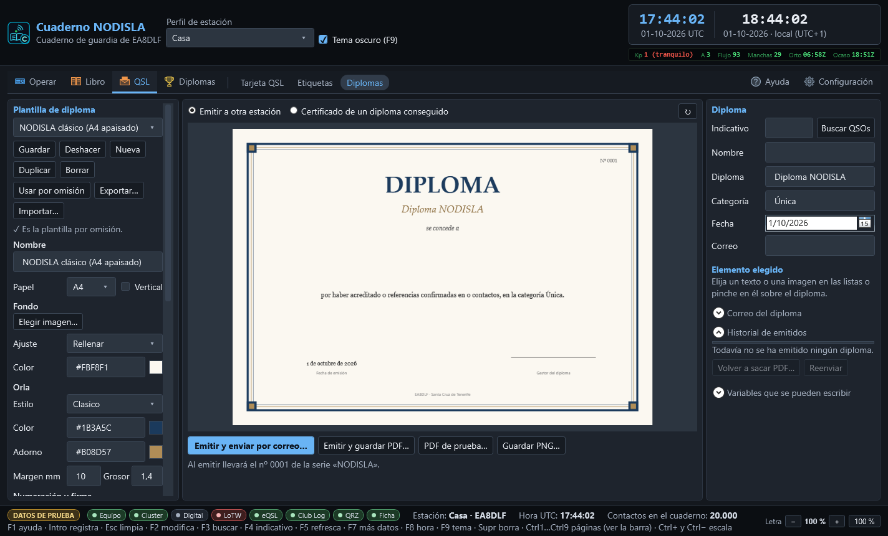
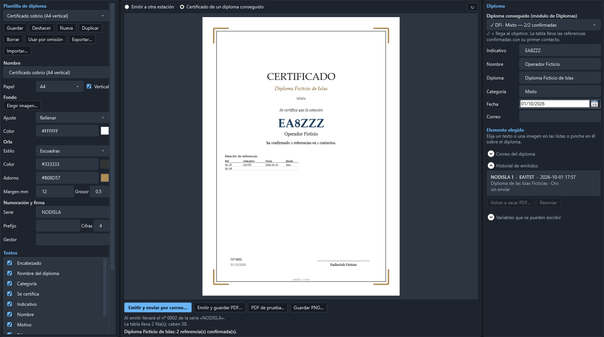
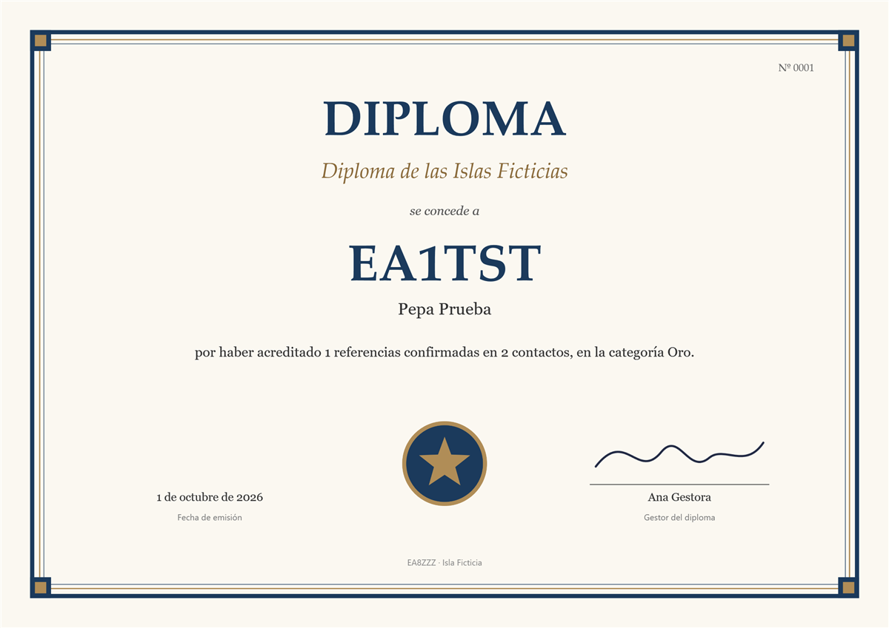

# Diseñador de diplomas y certificados

En **QSL › Diplomas** (`Ctrl` `Mayús` `5`) se diseñan e imprimen diplomas con el mismo editor que la
[tarjeta QSL](13-tarjeta-qsl.md): plantillas, fondo, textos que se arrastran y una vista previa
que es el dibujo de verdad. Sirve para dos cosas:

- **Emitir a otra estación** un diploma propio o de club: se escribe su indicativo, el programa
  busca sus contactos en el cuaderno y lo rellena solo.
- **Imprimir el certificado de un diploma conseguido**, sacado del módulo de
  [Diplomas](05-diplomas.md), con la relación de referencias confirmadas.

## La plantilla (columna izquierda)

- **Plantilla** — **Guardar**, **Deshacer**, **Nueva**, **Duplicar** (copia también sus
  imágenes), **Borrar** (una de fábrica vuelve a como venía), **Usar por omisión**,
  **Exportar…** e **Importar…**: un solo fichero `.diploma-nodisla` con la plantilla y sus
  imágenes, para llevarla a otro equipo o pasársela a otro operador. Se guardan en la carpeta de
  datos, en `qsl\diplomas\`.
- **Papel** — A4 o Carta, apaisado o **Vertical**. Al cambiarlo todo se recoloca en proporción.
- **Fondo** — una imagen (foto, textura de papel o una orla dibujada) con su ajuste, y el color
  del papel debajo.
- **Orla** — *Filete*, *DobleFilete*, *Clasico* (doble filete con cuadros en las esquinas) o
  *Escuadras*, con su color, su color de adorno, margen y grosor.
- **Numeración y firma** — la **serie** (cada serie numera por su cuenta; varias plantillas
  pueden compartirla), el prefijo (`EA8-`, `2026/`…), las cifras y el **gestor** que firma.
- **Textos** — los mismos campos que la QSL: letra, tamaño, color, alineación y, para párrafos,
  un **ancho máximo** a partir del cual el texto pasa a la línea siguiente.
- **Logo, firma e imágenes** — huecos preparados en las plantillas de fábrica; **Elegir
  imagen…** pone su logo o su firma escaneada. La imagen se copia a la carpeta de la plantilla.
- **Tabla de referencias o contactos** — opcional: posición, bloques uno al lado de otro, letra
  y columnas. Lo que no cabe sale en **hojas de anexo** del PDF con la misma orla.

Plantillas de fábrica: *NODISLA clásico* (A4 apaisado), *NODISLA atlántico, con tabla*,
*Certificado sobrio* (A4 vertical) y *Volcán* (Carta apaisado). Sobrias, en los colores de
NODISLA y sin marcas de nadie.

## A quién va (columna derecha)

- **Emitir a otra estación** — escriba el indicativo y pulse **Buscar QSOs**: sale la lista de
  contactos (desmarque los que no cuenten) y se rellenan el nombre y el correo si el contacto o
  su ficha los tienen.
- **Certificado de un diploma conseguido** — elija el diploma (✓ = llega al objetivo). El
  certificado lleva su indicativo, el diploma, la variante como categoría, la entidad que lo
  concede y la tabla de referencias confirmadas con su primer contacto.

### Variables

| Variable | Qué pone |
|---|---|
| `{indicativo}` `{nombre}` | Quien recibe el diploma |
| `{diploma}` `{categoria}` | Nombre del diploma y categoría o nivel |
| `{numero}` `{serie}` | Número correlativo (con prefijo y ceros) y su serie |
| `{fecha}` `{fechacorta}` `{fechaiso}` | Fecha de emisión: «30 de septiembre de 2026», 30/09/2026, 2026-09-30 |
| `{referencias}` `{qsos}` | Cuántas referencias y cuántos contactos lo justifican |
| `{primerqso}` `{ultimoqso}` `{bandas}` `{modos}` | Resumen de los contactos |
| `{entidad}` `{gestor}` | Quien lo concede y quien firma |
| `{miindicativo}` `{minombre}` `{miqth}` `{milocalizador}` | Mi estación |

En las columnas de la tabla: `{referencia}` `{nombrereferencia}` `{indicativo}` `{fecha}`
`{hora}` `{banda}` `{modo}` `{rst}` `{n}`.

## Emitir, imprimir y enviar

- **Emitir y guardar PDF…** — le da el **siguiente número de la serie**, lo apunta en el
  historial y guarda el PDF (del tamaño del papel, con el texto buscable).
- **Emitir y enviar por correo…** — igual, y lo manda en PDF por el **mismo servidor que las
  QSL** (Configuración › Correo de las QSL), con el asunto y el texto de «Correo del diploma».
- **PDF de prueba…** y **Guardar PNG…** — sin emitir, para revisar: el número que se ve es el que
  le tocaría.
- **Historial de emitidos** — quién, cuándo, con qué número y si se mandó. **Volver a sacar
  PDF…** lo reimprime con el mismo número y los datos de entonces; **Reenviar** lo vuelve a mandar.

Un número emitido no se repite nunca: va en el cuaderno, y la base de datos rechaza dos diplomas
con el mismo número en la misma serie.

