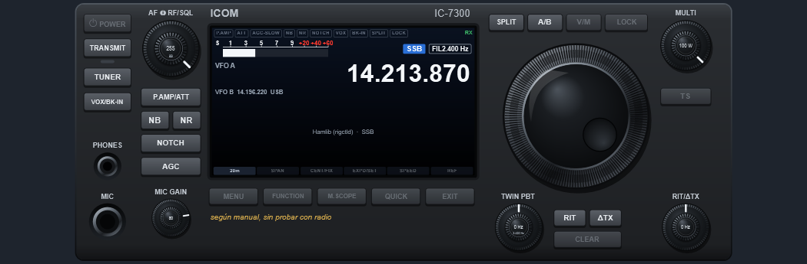
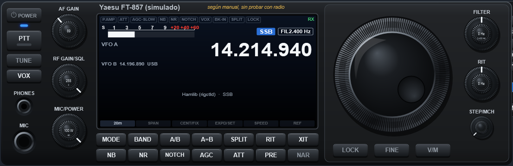
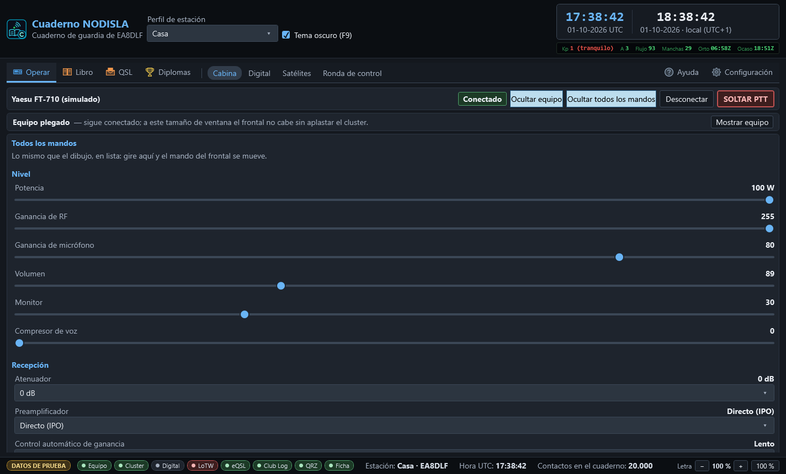
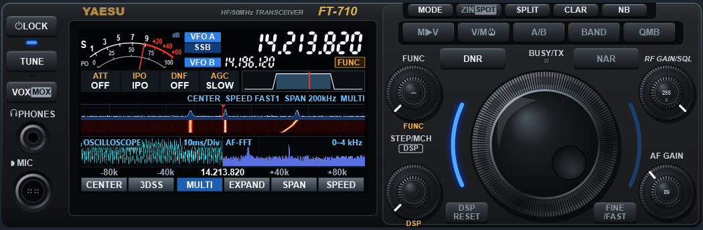
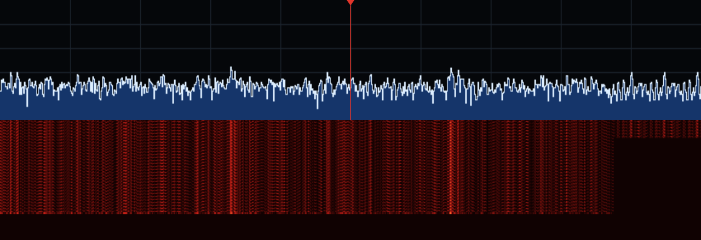
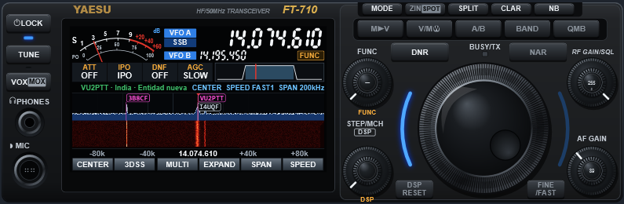
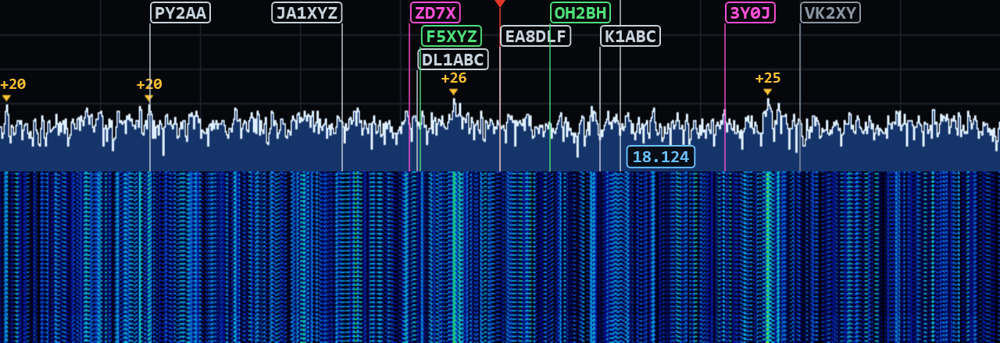
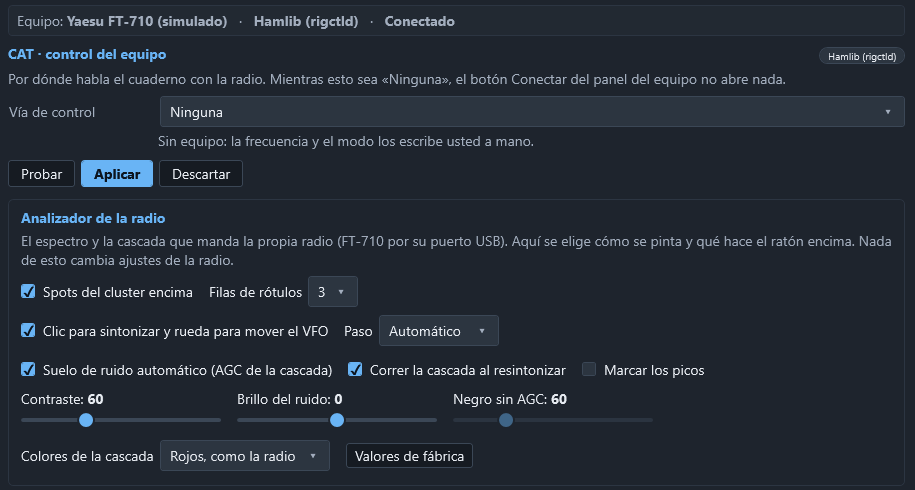

# Equipos: el FT-710, otros Yaesu e ICOM

El cuaderno habla con la radio por **CAT nativo**: el juego de órdenes del propio fabricante,
por el puerto serie del equipo. Es lo que permite dibujar el frontal, mover sus mandos y leer
sus medidores. Se configura en **Configuración › Equipo (CAT)** (ver
[Primer uso](01-primer-uso.md#paso-4--configuración--equipo-cat-con-el-ft-710)).

## Qué equipos hay

| Fabricante | Modelos | Cómo habla |
|---|---|---|
| **Yaesu** (CAT nuevo) | **FT-710**, FTDX10, FTDX101D, FTDX101MP, FT-991, FT-991A, FT-891, FTDX3000, FTDX5000, FTDX1200 | Órdenes de texto acabadas en `;` |
| **Yaesu** (CAT antiguo) | FT-817, FT-818, FT-857, FT-897 | Órdenes de 5 bytes; no se autodetectan |
| **ICOM** | IC-7300, IC-7610, IC-705, IC-7100, IC-9700, IC-7851 | CI-V, con la dirección de cada modelo |

El **FT-710 está probado con la radio de verdad**. Los demás están programados **según el
manual, sin probar con radio**: el desplegable de modelo y el panel del equipo lo dicen con
letras. Si tiene uno de ellos y algo no cuadra, repórtelo desde **Ayuda › Reportar un fallo**:
el informe ya lleva el modelo y la vía.

En ICOM, la **dirección CI-V** de fábrica de cada modelo ya está puesta; si la cambió en la
radio, escríbala en el apartado. Para cualquier otro equipo quedan **rigctld** (Hamlib, por TCP)
y **OmniRig**, con lo básico: frecuencia, modo y PTT.

Si no sabe qué radio es o en qué puerto está, elija **Detectar automáticamente**: se prueba el
puerto guardado y después todos, preguntando identificación. **Solo se pregunta; nunca se
transmite.**

## El frontal

Con el equipo conectado, **Operar › Cabina** dibuja su frontal: el del FT-710 con sus 24 mandos,
y frontales propios para el FTDX10, el FTDX101, el FT-991A, el FT-891, el IC-7300, el IC-7610 y
el IC-705. Los demás salen con un **frontal genérico** con lo que el equipo declara.

Los mandos se tocan igual que en la radio: rueda del ratón o flechas del teclado. En los
mandos dobles, la rueda sobre el centro (o `Mayús` + flechas) mueve el mando de dentro. Un mando que el equipo no admite **no sale**: no hay botones muertos.

- **Todos los mandos** despliega la lista completa de lo que declara el equipo, con su valor y
  su recorrido. Mover uno en la lista lo mueve en el dibujo, y al revés.
- **Ocultar equipo** pliega el frontal para dejar sitio; se recuerda de una vez a otra.
- **SOLTAR PTT**, en rojo y siempre a la vista, baja el PTT sin preguntar.

## El analizador de espectro del FT-710

La pantalla del frontal del FT-710 enseña **el espectro de la propia radio**, el mismo que se ve
en su pantalla: traza, cascada y la marca roja del VFO. No lo calcula el PC: lo manda la radio
por el USB, a través del puente FTDI FT4222 que lleva dentro.

Hace falta:

1. En la radio, **MENU › OPERATION SETTING › GENERAL › SCU-LAN10 = ON** (no hace falta tener
   la SCU-LAN10).
2. En el PC, el controlador **D2XX** de FTDI.

Las teclas de debajo de la pantalla hacen lo mismo que en la radio: **CENTER** / **FIX**,
**3DSS** (vista en perspectiva), **EXPAND** (más alto para el analizador), **SPAN** − / + y
**SPEED** − / +. Al pulsarlas se manda la orden a la radio, y lo que se cambie en la radio se ve
aquí.

Si no llega el espectro, el analizador dice por qué: falta la biblioteca de FTDI, no aparece el
dispositivo (radio apagada o sin controlador) o no llegan tramas (mire **SCU-LAN10**). Se
reintenta solo cada pocos segundos.

### MULTI: osciloscopio y AF-FFT

La tecla **MULTI** hace lo que la pantalla MULTI del FT-710: el analizador en pequeño arriba y,
debajo, el **osciloscopio** y el **AF-FFT** del audio de recepción. Es una vista del programa,
no manda nada a la radio. Usa la entrada de audio del códec del equipo (la misma del módem); si
el audio no está abierto, el aviso de MULTI ofrece abrirlo.

### Spots, clic y rueda sobre el analizador

- **Spots del cluster encima**: cada anuncio de la lista que cae en lo que se ve sale con su
  indicativo en su frecuencia, en filas para que no se pisen. **Magenta**: entidad nueva;
  **verde**: banda o modo nuevos; **gris**: ya trabajado. Con el ratón encima, el detalle del
  anuncio. **Clic en el rótulo** = el doble clic de la lista: frecuencia y modo al equipo e
  indicativo al contacto nuevo.
- **Clic en el espectro**: lleva el **VFO activo** (el A o el B, el que esté elegido en la radio
  en ese momento) a ese punto, **ajustado al paso**. Mientras el ratón está encima, una línea
  fina y una cifra dicen a qué frecuencia iría.
- **Rueda del ratón** encima: mueve el VFO activo **un paso por muesca**. Con **Mayús**, paso fino
  (la décima parte) en el clic y en la rueda.
- El **paso** es automático según el ancho que se ve (500 Hz con 200 kHz de span, 50 Hz con
  20 kHz), o el que se elija.
- **Nada de esto funciona transmitiendo** ni sin equipo conectado: el analizador no cambia la
  frecuencia con la portadora puesta.

### Suelo de ruido, colores y picos

La radio manda niveles relativos (0-255) que cambian con la banda, el span, el preamplificador y
el atenuador. Con el **suelo de ruido automático** (AGC de la cascada) el cuaderno sigue el ruido
y pone el negro justo debajo: la cascada sale con buen contraste **sin tocar la radio**, y al
volver a una banda ya vista sale bien desde la primera fila (se recuerda el suelo de cada banda y
span). Al resintonizar en CENTER, la **cascada se corre** con la frecuencia: cada señal sigue en
su sitio en vez de emborronarse en diagonal.

Todo se ajusta en **Configuración › Equipo › Analizador de la radio**: spots encima y filas de
rótulos, clic para sintonizar y paso, suelo automático, **contraste**, **brillo del ruido**,
**colores de la cascada** (rojos como la radio, NODISLA, arcoíris, fuego, hielo o grises),
**marcar los picos** (las cinco señales más altas con una marca ámbar y lo que asoman sobre el
ruido) y correr la cascada al resintonizar. Nada de esto cambia ajustes de la radio.

## La botonera: bandas, modos, memorias y canales CB

A los lados del frontal (en **Cabina** y en **Digital**):

- **HAM**, a la izquierda: **Banda** (vuelve a la última frecuencia y modo de esa banda, como la
  tecla BAND), **Modo** (LSB · USB · CW · AM · FM · DATA; DATA es DATA-L por debajo de 10 MHz y
  DATA-U por encima) y **Memoria** (M1 … M6).
- **Canales CB**, a la derecha: los 40 canales de 27 MHz con su **plan** (11m · UK · CEPT · PL ·
  USA, se recuerda).

La tecla de la banda, el modo o el canal en que está el dial se ve en azul. **Nada de la
botonera transmite.** Sin equipo conectado, las teclas se apagan y dicen por qué.

## Lo que el programa no hace nunca con la radio

- Conectarse solo al abrir.
- Transmitir sin una acción del operador (y, en el módem, sin abrir antes el pestillo).
- Cambiar menús de la radio. Solo **lee** los que necesita para avisar (por ejemplo, la fuente
  de modulación para la fonía).
- Cambiar la frecuencia desde el analizador mientras se transmite.
- Dejar un PTT subido: el **vigilante de PTT** lo baja al agotarse el tiempo máximo, si se pierde
  la comunicación, si salta un fallo o al cerrar el programa.
