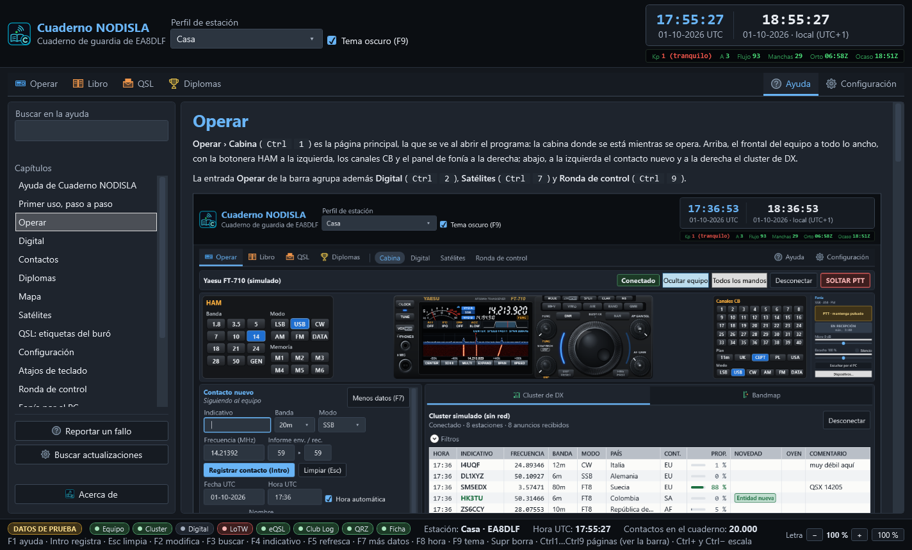
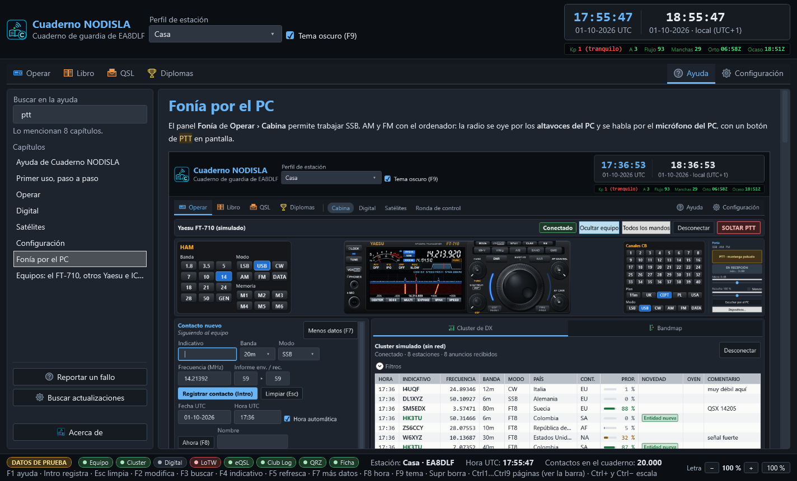
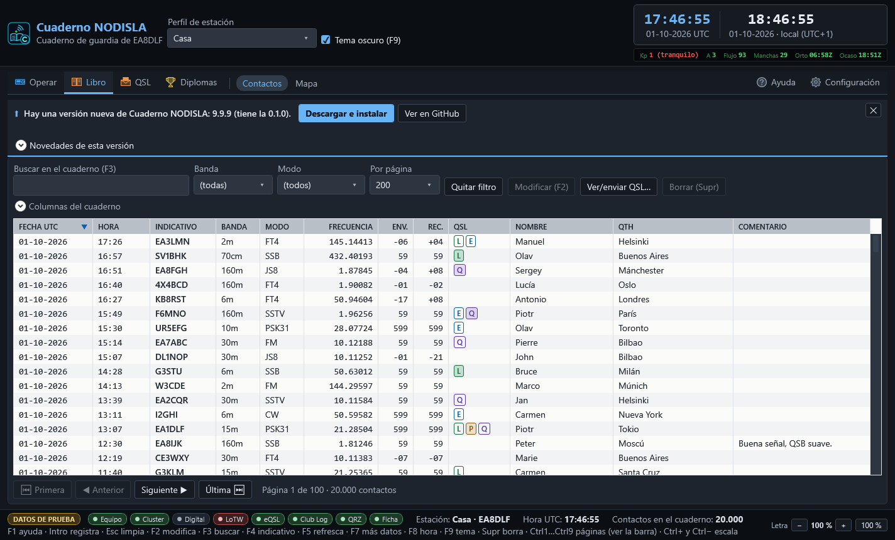
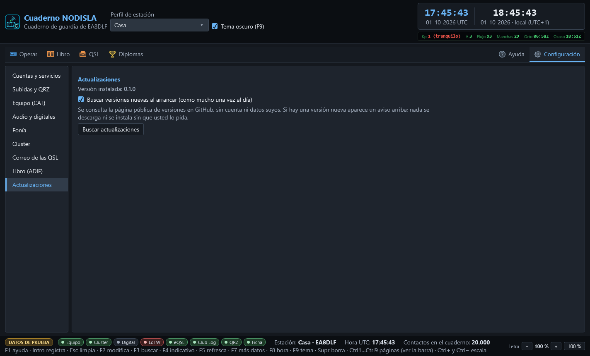
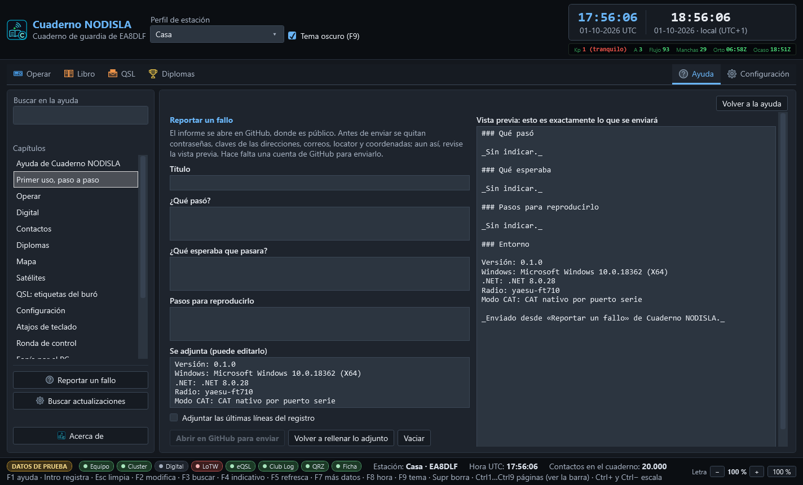
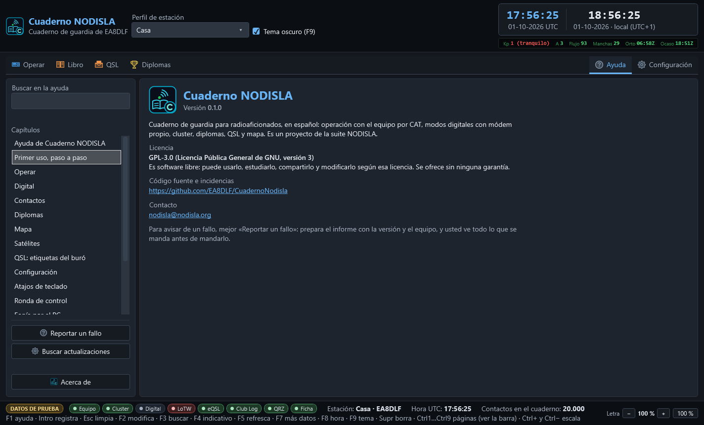

# Ayuda, actualizaciones y reporte de fallos

## La ayuda

La entrada **Ayuda**, a la derecha de la barra, abre esta misma ayuda dentro del programa: sin
navegador y sin conexión. A la izquierda, el buscador y el índice de capítulos; a la derecha, el
capítulo con sus capturas. Los enlaces entre capítulos se siguen con un clic.

- **F1**, desde cualquier página, abre la ayuda **por el capítulo de esa página**: desde la
  Cabina, el de Operar; desde Configuración, el de Configuración; desde QSL › Diplomas, el del
  diseñador.
- **Buscar en la ayuda**: escriba una o varias palabras, sin preocuparse de mayúsculas ni
  tildes («fonia» encuentra «fonía»). El índice se queda con los capítulos que las mencionan y,
  dentro del capítulo, las palabras salen resaltadas.
- La letra sigue a la de la ventana: con `Ctrl` `+` y `Ctrl` `−` crece y mengua con todo lo
  demás.

La ayuda que se lee dentro del programa es siempre la de **su misma versión**: va dentro del
ejecutable.

## El aviso de versión nueva

Al arrancar (en segundo plano y **como mucho una vez al día**) el programa mira en la página
pública de versiones de GitHub si hay una más nueva. Si la hay, aparece una barra fina encima de
la página, sin ventanas ni robar el foco:

- **Novedades de esta versión** despliega las notas.
- **Descargar e instalar** baja el instalador, **comprueba su suma SHA-256** y, si cuadra, cierra
  el programa de forma ordenada y lo instala. Si la suma no cuadra o falta, borra lo descargado
  y no instala nada.
- **Ver en GitHub** abre la página de la versión.
- **✕** oculta el aviso; de esa versión no se vuelve a avisar al arrancar.

**Nada se descarga ni se instala sin que usted lo pida**, y la consulta no lleva cuenta ni datos
suyos. Sus datos (`%AppData%\CuadernoNodisla\`) no se tocan al actualizar.

### Buscar actualizaciones a mano

Desde **Ayuda › Buscar actualizaciones** o desde **Configuración › Actualizaciones**. Es el
mismo aviso: si hay versión nueva, se enciende la barra de arriba. En Configuración se elige
además si se busca al arrancar.

## Reportar un fallo

**Ayuda › Reportar un fallo** prepara un informe para el equipo de NODISLA. Cada vez que se abre
sale un formulario nuevo, con el entorno de ese momento.

1. Rellene el **título**, **qué pasó**, **qué esperaba** y, si puede, los **pasos para
   reproducirlo**.
2. **Se adjunta** la versión, Windows, el equipo y la vía de CAT. Se puede editar. Si quiere,
   marque **Adjuntar las últimas líneas del registro**.
3. Mire la **vista previa**: es exactamente lo que se enviará. Antes de enviar se quitan
   contraseñas, claves, correos, localizadores y coordenadas, pero revíselo igualmente.
4. **Abrir en GitHub para enviar** abre en el navegador la página de nueva incidencia del
   repositorio con todo relleno. Se envía con su cuenta de GitHub; el programa no lleva ninguna
   clave y no manda nada por su cuenta.

Si el informe es muy largo para la dirección, el cuerpo va al portapapeles y la página le dice
que lo pegue.

## Acerca de

**Ayuda › Acerca de** enseña la versión instalada, la licencia, el repositorio y el contacto.

- **Licencia**: GPL-3.0, software libre y sin garantía.
- **Código e incidencias**: [github.com/EA8DLF/CuadernoNodisla](https://github.com/EA8DLF/CuadernoNodisla)
- **Contacto**: [nodisla@nodisla.org](mailto:nodisla@nodisla.org)
