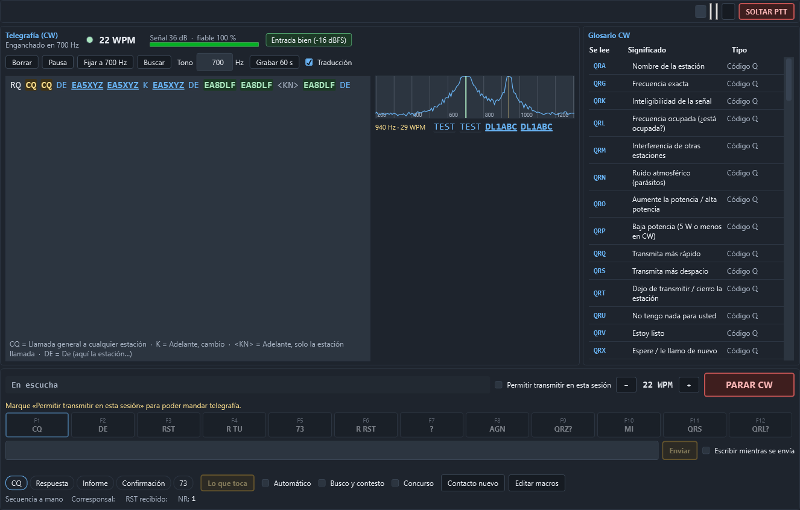
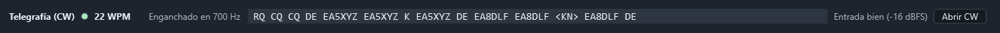
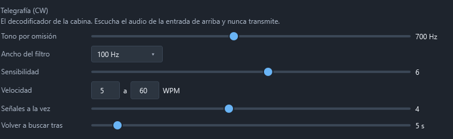

# Telegrafía (CW)

La página **Operar › CW** (`Ctrl` `Mayús` `1`) lee la telegrafía que se oye por el equipo y la
escribe en pantalla, con su velocidad, su tono y lo que significa cada abreviatura. El
decodificador es del propio programa: no hace falta fldigi, CW Skimmer ni ningún otro programa.

**Solo escucha.** El decodificador no transmite ni manda nada al equipo: del CAT lee el modo y el
tono de telegrafía (*pitch*), y nada más.

## Dónde está

- **Operar › CW**: la página entera. Arriba, la barra y el frontal del equipo (el mismo que en
  la cabina y en Digital); debajo, el decodificador a lo grande; a la derecha, el **glosario CW**;
  y abajo, el sitio de la **transmisión en CW** (macros y escritura libre).
- **En la cabina**, una sola línea con lo último que se ha leído, la velocidad, el estado y
  **Abrir CW**. Sale sola cuando el equipo pasa a **CW**; con el botón **CW** de la derecha de la
  barra del equipo sale también en otros modos, y **Ocultar** la quita. La cabina es para el
  contacto y el cluster: por eso ahí va solo esa línea.

Escucha mientras se ve (la página, o la línea de la cabina) y no está en pausa, por la entrada
elegida en **Configuración › Audio y digitales** (el codec USB del FT-710). Si esa entrada está
cerrada, ofrece **Escuchar**, que la abre sin tocar la radio. El audio se comparte con el módem
digital y la fonía.

## Qué enseña

- **El estado**: *Buscando señal…*, *Enganchado en 700 Hz* o *Fijo en 700 Hz*, y cuánto lleva
  sin señal.
- La **luz** que se enciende con cada punto y raya: si parpadea al ritmo de lo que se oye, el
  decodificador está bien enganchado.
- **WPM**: la velocidad, de 5 a 60 palabras por minuto. Sigue los cambios y la mano de quien
  manipula.
- **Señal** en dB sobre el ruido y **fiable**: cuánto se parecen los tiempos a los de la
  telegrafía.
- **La entrada**: *Entrada bien*, *Entrada baja* (suba el volumen del codec) o *Entrada
  SATURADA* (baje el volumen del codec o la ganancia de AF). El decodificador **no depende del
  nivel**: lee igual de −40 a +10 dB de diferencia; el indicador es para que la tarjeta no
  recorte ni se quede sin bits.
- El **texto** en vivo, **palabra a palabra**. Se desplaza solo mientras se está abajo.

### Indicativos, abreviaturas y prosignos

- Los **indicativos** salen subrayados: **un clic lo pasa al «Contacto nuevo»**. Al pasar el
  ratón, el **país**.
- **CQ** y **QRZ?** salen en ámbar: alguien está llamando.
- **Su indicativo** sale en verde: le están llamando a usted.
- Las **abreviaturas** y los **códigos Q** conocidos (TU, FB, 73, QTH, QRZ, 5NN…) salen en otro
  color, con un subrayado fino: **al pasar el ratón dicen qué significan**.
- **Traducción** (casilla de los mandos): una línea debajo del texto con el significado de las
  últimas abreviaturas: «TU = Gracias · 73 = Saludos cordiales».
- Los **prosignos** salen entre ángulos (`<AR>`, `<SK>`, `<BT>`, `<KN>`, `<AS>`…), también con
  su significado.

### El glosario CW

A la derecha de la página, la lista entera: los **códigos Q** (QRA a QTR), las **abreviaturas**
(CQ, DE, K, R, TU, TNX, FB, OM, YL, ES, HR, UR, RST, 5NN, AGN, PSE, GM/GA/GE/GN, 73, 88…), los
**prosignos** y los **números cortos de concurso** (T = 0, A = 1, U = 2, V = 3, E = 5, B = 7,
D = 8, N = 9). Todo en el idioma del programa.

## El tono: AUTO, buscar y fijar

- **AUTO** (de fábrica): busca la señal **más fuerte** entre 300 y 1200 Hz. En cuanto empieza a
  leerla, **se engancha a ella**: ya no salta a otra aunque suba más, ni en las pausas entre
  palabras, ni en los bajones de QSB. Solo vuelve a buscar cuando la señal lleva **5 segundos**
  sin aparecer (se cambia en los ajustes) o al pulsar **Buscar**.
- **Fijar a … Hz** fija el tono al *pitch* del equipo (en el FT-710, **CW PITCH**). Sin CAT, al
  tono que tenga ahora. Con el tono fijo, el botón pasa a **Auto**.
- **Tono** (la casilla): escriba los hercios (300 a 1200) y pulse `Intro`; las flechas `↑` `↓` y
  la rueda del ratón lo mueven de 10 en 10 Hz.
- **Un clic en el mini espectro** fija el tono en ese punto: es la forma de elegir una señal
  débil que tiene otra más fuerte al lado.

## El mini espectro y las demás señales

El audio de 200 a 1300 Hz: la **raya verde** es la señal que se lee; las **rayas ámbar**, las
demás que se leen a la vez (el «skimmer»), cada una con su línea debajo.

## Los demás botones

- **Borrar** limpia el texto. **Pausa** deja de escuchar; **Seguir** vuelve.
- **Grabar 60 s** guarda un minuto del audio tal como llega del equipo en
  `%AppData%\CuadernoNodisla\grabaciones-cw\`. Sirve para mandarnos un caso que no se lee bien
  (a nodisla@nodisla.org). No transmite nada.

## El ruido no escribe

El ruido de la banda, el QRN y las señales troceadas no escriben basura:

- el texto no sale hasta que se reconocen varios caracteres seguidos con tiempos de telegrafía y
  con letras de verdad (no solo E, I, T y S);
- lo enganchado se vigila palabra a palabra: si el texto empieza a tener la pinta del ruido
  («E E ET IEI TTEA…»), deja de escribir y se desengancha;
- el silenciador mide el ruido en el momento: tocar la ganancia de RF o el AGC del equipo no lo
  engaña.

Lo que se leyó antes de engancharse no se pierde: sale de golpe en cuanto se engancha.

## Ajustes

En **Configuración › Audio y digitales**, apartado **Telegrafía (CW)**:

- **Tono por omisión**: con el que arranca (700 Hz de fábrica).
- **Ancho del filtro**: 100 Hz va bien casi siempre.
- **Sensibilidad** (1 a 10): más alta lee señales más débiles. El ruido no escribe con ninguna.
- **Velocidad**: las que se siguen, de 5 a 60 WPM.
- **Señales a la vez**: además de la principal, cuántas más se leen. Con 1, solo la principal.
- **Volver a buscar tras**: segundos sin la señal enganchada antes de buscar otra (5 de fábrica).

Pulse **Guardar**: el decodificador toma los ajustes nuevos en el acto.

## Cuánto lee

Medido con telegrafía sintética sobre ruido blanco (las cifras completas están en
`tests/Nodisla.Cuaderno.Modos.Pruebas/Banco/resultados-cw.md`), con la relación señal-ruido en
500 Hz, la habitual en telegrafía (errores de carácter):

| Señal (S/R en 500 Hz) | 12 WPM | 20 WPM | 30 WPM | 40 WPM |
|---|---:|---:|---:|---:|
| +17 dB | 6 % | 6 % | 2 % | 3 % |
| +7 dB | 6 % | 2 % | 2 % | 8 % |
| +3 dB | 3 % | 4 % | 8 % | 29 % |
| +1 dB | 86 % | 89 % | 90 % | 85 % |

A +1 dB y por debajo casi no escribe: prefiere **callarse** a escribir basura. Con el ruido real del FT-710,
de −40 a +10 dB de nivel de entrada, se copia igual (2 % de errores con la señal 6 dB sobre el
ruido del filtro).
