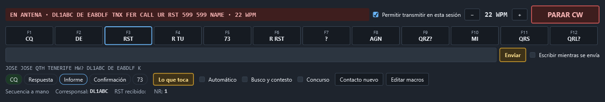
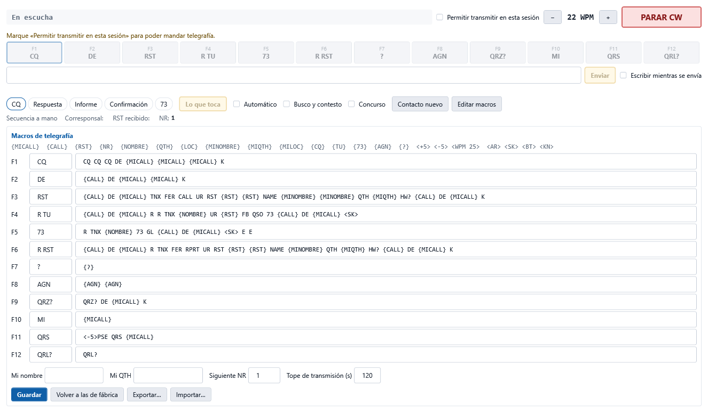

# Transmitir en CW

La zona **Transmitir en CW** manda telegrafía desde el cuaderno: doce macros en las teclas
**F1** a **F12**, un renglón para escribir lo que quiera y una secuencia del contacto que puede
ir sola, como la del FT8 del módem propio.

**La telegrafía la genera la radio, no el ordenador.** El cuaderno le pasa el texto al
manipulador interno del equipo por CAT; el PC no produce ningún audio. Por eso hace falta un
equipo que sepa manipular por CAT:

| Equipo | Cómo se manda |
|---|---|
| **FT-710** | El texto se escribe en la memoria de texto 5 del manipulador (`KM5…;`) y se reproduce (`KY05;`), en trozos de 50 caracteres. Lo que tenía esa memoria se le devuelve al terminar. |
| **ICOM** (CI-V) | Orden `17` con hasta 30 caracteres; `17 FF` para. |
| **Hamlib** (rigctld) | `send_morse`; `stop_morse` para. Depende de que Hamlib sepa hacerlo con su equipo. |
| Los demás Yaesu, OmniRig | No: el botón queda apagado y se dice por qué. |

## Antes de transmitir: las seis puertas

Nada sale al aire sin pasar por todas, en este orden:

1. **El interruptor CW** no apagado. Apaga la transmisión en telegrafía, independiente de Digital
   y RTTY; no afecta al decodificador de [Telegrafía (CW)](17-cw.md), que sigue escuchando.
2. **Permitir transmitir en esta sesión** marcado. Es el mismo pestillo del módem digital:
   empieza cerrado en cada arranque y no se guarda.
3. **Un equipo que manipule por CAT**, conectado. Si no, la línea amarilla dice por qué.
4. **El equipo en CW.** Si está en otro modo, se pregunta antes de cambiarlo; si dice que no,
   no se transmite.
5. **La pregunta de transmitir**, con el texto que va a salir. Tiene el mismo «No volver a
   preguntar» que el módem (se vuelve a encender en **Configuración › Audio y digitales**).
6. **El vigilante del PTT**, que es quien sube y baja la antena, como en todo el programa, con
   sus [salvaguardas](19-seguridad-de-transmision.md): plan de banda, ROE y potencia por banda.

**Nunca se transmite al arrancar ni al conectar**: solo con una tecla o un botón suyo, o con el
automático que usted ha encendido en esta sesión.

## Parar: Esc o PARAR CW

**Esc** o el botón rojo **PARAR CW** cortan en el acto: mandan la orden de parar al manipulador
del equipo y bajan el PTT. Esc funciona en cualquier página mientras haya algo saliendo o el
automático puesto. Además:

- Hay un **tope de transmisión** (120 s de fábrica, se cambia en el editor de macros). Pasado,
  se corta. Detrás sigue el tope del vigilante del PTT, que no depende de nada.
- Cualquier bajada del PTT —la normal, el tope, el pánico, perder el equipo, cerrar el
  programa— para antes el manipulador: con el *break-in* puesto, la radio podría seguir
  manipulando sola.
- Cerrar el pestillo también corta lo que esté saliendo y apaga el automático.

## Las macros

Cada botón es una macro; su tecla F la manda. La que toca en la secuencia sale recuadrada.

Variables que se rellenan al mandar:

| Variable | Qué pone |
|---|---|
| `{MICALL}` | Su indicativo (el del perfil de estación activo). |
| `{CALL}` | El indicativo del **Contacto nuevo**. |
| `{RST}` | El RST que da (599 si no hay otro; en concurso, 5NN). |
| `{NR}` | El número de serie, con tres cifras. |
| `{NOMBRE}` `{QTH}` `{LOC}` | Nombre, QTH y localizador del corresponsal. |
| `{MINOMBRE}` `{MIQTH}` `{MILOC}` | Los suyos. |
| `{CQ}` `{TU}` `{73}` `{AGN}` `{?}` | CQ (CQ TEST en concurso), TU, 73, AGN, ?. |

**Velocidad dentro de la macro:** `<+5>` y `<-5>` suben o bajan desde ahí hasta el final;
`<WPM 25>` la pone fija. **Prosignos:** `<AR>`, `<SK>`, `<BT>`, `<KN>`.

Si una macro usa `{CALL}` y el contacto nuevo no tiene indicativo, no se manda y se avisa.

La velocidad de partida se cambia con **−** y **+** (de 2 en 2 WPM).

### Dos juegos: QSO normal y concurso

- **QSO normal**: F1 CQ, F2 contestar a un CQ, F3 informe con nombre y QTH, F4 confirmación y
  73, F5 despedida, F6 informe con R (cuando contesta usted), y de F7 a F12 ?, AGN, QRZ?, su
  indicativo, QRS y QRL?.
- **Concurso** (casilla **Concurso**): F1 CQ TEST, F2 intercambio (5NN y número), F3 TU, F4 su
  indicativo, F5 el del otro, F6 repetir el intercambio… Al estilo de N1MM.

### Editar, guardar, exportar

**Editar macros** abre el editor: rótulo y texto de cada una, su nombre, su QTH, el siguiente
número de serie y el tope de transmisión. **Guardar** las deja en el fichero
`transmision-cw.json` de la carpeta de datos. **Volver a las de fábrica** repone el juego en uso.
**Exportar…** e **Importar…** pasan los dos juegos a un fichero y de un fichero.

## Escribir a mano

El renglón de texto manda lo que escriba al pulsar **Intro** o **Enviar** (admite las mismas
variables). Con **Escribir mientras se envía**, cada palabra sale en cuanto teclea su espacio,
detrás de lo que esté saliendo: puede ir escribiendo mientras la radio manipula. Debajo se ve
lo que falta por salir.

## La secuencia del contacto

La tira **CQ → Respuesta → Informe → Confirmación → 73** dice en qué paso está el contacto y
cuál toca (recuadrado). **Lo que toca** —o **Intro** con el renglón vacío— manda las macros de
ese paso: es el *Enter Sends Message* de N1MM.

- **Llamando** (lo normal): CQ → le contesta alguien → informe → su informe → confirmación, y
  el contacto queda completo.
- **Busco y contesto** (casilla): contestar al CQ de otro → su informe → su informe con R → su
  despedida → 73. En concurso se completa con el intercambio.

La secuencia avanza con **lo que lee el decodificador de la página CW**:

- si oye su indicativo seguido de otro («EA8DLF DE DL1ABC»), o solo un indicativo tras su CQ,
  toma ese como corresponsal y lo pone en el **Contacto nuevo**;
- de su informe saca el RST, el nombre (NAME, OP), el QTH y el localizador, y en concurso el
  número (con los números cortados: T = 0, N = 9…);
- espera a que el otro termine (un `K`, `KN`, `<AR>`… o un silencio) antes de contestar;
- un «?», «AGN», «NR?»… hace repetir lo último;
- si el otro está con otra estación, no se mete.

Mientras usted transmite, lo que lee el decodificador (su propio tono de escucha) no cuenta.

### Automático

Con **Automático**, la secuencia contesta sola, como el «Tx habilitado» del FT8. Pasa por las
mismas cinco puertas: si la pregunta de transmitir está puesta, se le pregunta cada vez. Si
nadie contesta, repite lo último tras 12 s de silencio, hasta 3 veces, y luego se apaga solo.
También se apaga al parar, al cerrar el pestillo o si se dice que no a una pregunta. Empieza
apagado en cada arranque.

### Al completar

Con el contacto completo, el **Contacto nuevo** queda relleno (indicativo, RST dado y
recibido, nombre, QTH, localizador; en concurso, los números en el comentario). Si en
**Configuración › Audio y digitales** está **Registrar al completar** —el mismo ajuste del FT8—,
se apunta solo en el cuaderno; si no, queda listo para pulsar **Registrar**. **Contacto nuevo**
vuelve la secuencia al principio sin borrar el formulario.

## Antes de la primera vez con la radio

- En el FT-710, el cuaderno usa la **memoria 5 del manipulador** (menú CW SETTING › KEYER › CW
  MEMORY 5 en **TEXT**). Lo que tuviera se le devuelve al terminar cada transmisión.
- Ningún equipo dice por CAT cuándo ha terminado de manipular: el cuaderno lo calcula con la
  velocidad. Si cambia el **peso** (CW WEIGHT) del manipulador, los trozos largos pueden
  quedar algo más separados.
