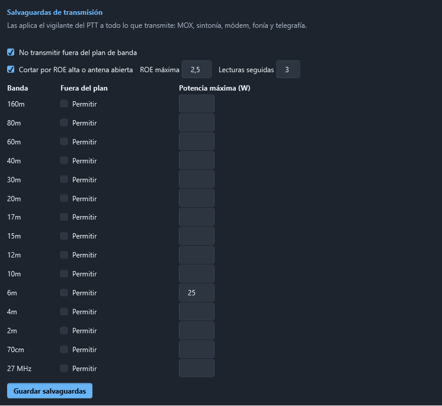

# Salvaguardas de transmisión

Todo lo que pone el equipo en antena —el MOX y el TUNE del frontal, el módem digital, la fonía y
la telegrafía— pasa por el **vigilante del PTT**, que es el único camino para salir al aire.
Además del tope de tiempo, el latido y el botón de pánico de siempre, el vigilante aplica estas
salvaguardas:

## Fuera del plan de banda no se transmite

Antes de subir el PTT se mira el **canal entero** que va a ocupar la emisión, no solo la
portadora, contra el plan de banda de la región 1 de la IARU que usa el programa:

| Modo | Canal que se mira |
|---|---|
| CW | la portadora más o menos medio ancho del filtro (500 Hz si el equipo no lo dice) |
| USB y modos de datos | de la portadora hacia arriba, el ancho del filtro (3 kHz como mínimo) |
| LSB | de la portadora hacia abajo |
| AM y FM | a los dos lados (6 y 16 kHz) |

Si un borde se sale del plan, **no se transmite** y se dice por qué, con las frecuencias: por
ejemplo, en LSB a 7,002 MHz el canal baja hasta 6,999 MHz. Con *split*, se mira el VFO que
transmite.

**Licencias especiales.** En la tabla, **Permitir** deja transmitir fuera del plan en una banda
concreta. Pide una confirmación explícita («Sí, mi licencia lo permite») y queda anotado en el
registro. También se puede quitar del todo con **No transmitir fuera del plan de banda**, pero
no es lo recomendable.

## ROE alta o antena abierta: corte

Mientras se transmite, el vigilante lee la ROE del equipo cuatro veces por segundo:

- **FT-710**: el medidor `RM6` y la alarma **Hi-SWR** del propio equipo (`RI0`, segundo dato).
- **ICOM**: el medidor `15 12`.

Solo cuenta cuando hay potencia (en CW con la llave arriba la ROE no dice nada). Si pasa de la
**ROE máxima** (2,5 de fábrica) en varias **lecturas seguidas** (3), corta. Si llega a 3,0 o el
equipo da su alarma de ROE, corta en la primera lectura: antena abierta o en corto.

> En el FT-710, el manual CAT da el medidor de ROE en bruto (0 a 255) sin su curva; el programa
> usa la de la familia FTDX10/FTDX101 y, por encima, la alarma del propio equipo. Conviene
> comprobar la escala una vez con una carga artificial.

## Tras un corte, no se rearma solo

Si el vigilante corta por **ROE**, por el **tiempo máximo** o porque quien transmitía **dejó de
responder**, no deja volver a transmitir hasta que se suelten **todas** las fuentes de PTT:

- el **MOX** del frontal;
- el **Tx habilitado** del módem digital;
- el PTT de la **fonía**;
- la **telegrafía** (lo que esté saliendo y el automático).

Así una secuencia automática o una tecla que se quedó pulsada no vuelven a poner el equipo en
el aire una y otra vez. El motivo sale en rojo en este apartado y en la zona de telegrafía.

## Solo quien subió el PTT lo baja

En el uso normal, solo la fuente que tiene la antena la suelta al terminar: otra fuente no
puede ni subir el PTT encima ni bajarlo por ella. Las bajadas de emergencia —**PARAR CW**, Esc,
el botón de pánico, el tope, el cierre del programa— pueden siempre.

## Potencia máxima por banda

En la tabla, **Potencia máxima (W)** por banda. Antes de transmitir en esa banda se baja la
potencia del equipo a ese valor (`PC` en Yaesu, el nivel de potencia en ICOM). Si el equipo no
deja poner o comprobar la potencia, no se transmite. Vacío: sin límite.

Pulse **Guardar salvaguardas**: se aplican en el acto y quedan en `seguridad-tx.json`, en la
carpeta de datos.
