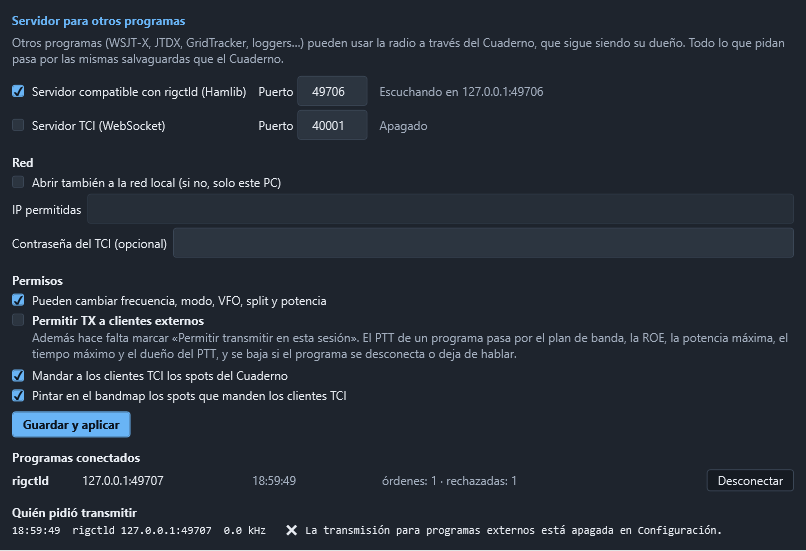

# Conectar otros programas

El Cuaderno abre el equipo en exclusiva: mientras está abierto, ningún otro programa puede usar
el puerto CAT. Para que WSJT-X, JTDX, GridTracker o un logger puedan **usar la radio a través
del Cuaderno**, el Cuaderno lleva un **servidor para otros programas**. El Cuaderno sigue siendo
el dueño de la radio: todo lo que pidan esos programas pasa por él y por sus salvaguardas.

Hay dos servidores, y los dos **arrancan apagados**:

| Servidor | Para qué programas | Dirección por omisión |
|---|---|---|
| **rigctld compatible** (protocolo de red de Hamlib) | WSJT-X, JTDX, fldigi, GridTracker y casi cualquier programa con «Hamlib NET rigctl» | `127.0.0.1:4532` |
| **TCI** (Expert Electronics, por WebSocket) | Programas que hablan TCI | `ws://127.0.0.1:40001` |

## Encenderlo

1. Abra **Configuración › Servidor para otros programas**.
2. Marque **Servidor compatible con rigctld** (o **Servidor TCI**) y deje el puerto que trae.
3. Pulse **Guardar y aplicar**. Al lado de cada servidor se ve si está escuchando y dónde.

En la barra de estado aparece **Programas externos: N**, con el número de programas conectados.
Al pasar el ratón por encima se ve quiénes son.

La lista **Programas conectados** se actualiza en vivo: protocolo, dirección, hora de conexión,
órdenes atendidas y rechazadas, y **TX** si ese programa tiene el PTT. **Desconectar** lo echa;
si estaba transmitiendo, primero se baja el PTT.

## Dejar transmitir a otros programas

Leer la radio y cambiar frecuencia, modo, VFO, split y potencia no pone nada en el aire. Para que
un programa pueda **transmitir** hacen falta **las dos** cosas:

- **Permitir TX a clientes externos**, en este apartado. Es el interruptor general, está apagado
  de fábrica y pide confirmación al encenderlo.
- **Permitir transmitir en esta sesión**, el mismo pestillo del módem y de la telegrafía, que
  empieza cerrado en cada arranque.

El PTT de un programa es **una fuente de PTT más**, con su nombre («rigctld 127.0.0.1:50311» o
«TCI 127.0.0.1:50320»), y pasa por el vigilante igual que el MOX, el módem o la fonía (ver
[Salvaguardas de transmisión](19-seguridad-de-transmision.md)):

- fuera del **plan de banda** no se transmite;
- se corta por **ROE** alta o antena abierta, y tras un corte **no se rearma** hasta que el
  programa mande soltar;
- la **potencia** se baja al máximo de la banda antes de salir;
- si **otra fuente** ya está en el aire, el programa no puede ni subir ni soltar ese PTT;
- vale el **tiempo máximo** de transmisión de siempre.

Además, el PTT de un programa **se baja en el acto** si el programa se desconecta, si deja de
hablar más de 10 segundos, si se cierra el pestillo de la sesión o si se apaga la TX externa.
Mientras el equipo está en el aire, los programas no pueden cambiar la frecuencia ni el modo.

Cada petición de transmitir queda en **Quién pidió transmitir**, con la hora, el programa, la
frecuencia, el modo y si se concedió o por qué no. También se escribe en el registro del programa.

## WSJT-X y JTDX (Hamlib NET rigctl)

En WSJT-X: **File › Settings › Radio**.

| Campo | Valor |
|---|---|
| **Rig** | `Hamlib NET rigctl` |
| **Network Server** | `127.0.0.1:4532` |
| **PTT Method** | `CAT` |
| **Mode** | `Data/Pkt` (o `None` si prefiere poner el modo a mano) |
| **Split Operation** | `Rig` o `Fake It` |
| **Poll Interval** | `1` s |

Pulse **Test CAT** (debe ponerse verde) y **Test PTT**. Para que Test PTT transmita tienen que
estar marcados los dos permisos de arriba; si no, el Cuaderno lo rechaza y WSJT-X avisa de un
error de PTT. JTDX se configura igual.

El **audio** no pasa por el servidor: en WSJT-X elija como entrada y salida el «USB Audio CODEC»
del FT-710, como siempre.

## GridTracker, fldigi y otros con Hamlib

Cualquier programa que ofrezca **Hamlib** con el modelo **NET rigctl** (número 2) se conecta igual:
dirección `127.0.0.1` y puerto `4532`. GridTracker y los loggers suelen limitarse a leer la
frecuencia y el modo.

## N1MM Logger+

N1MM Logger+ **no** habla Hamlib ni TCI: solo sabe manejar la radio por un puerto serie con el
CAT del propio equipo. Por eso no puede usar todavía este servidor. Lo que sí funciona hoy:

- el Cuaderno ya recibe por **UDP** los contactos que reparte N1MM, sin tocar la radio;
- para que N1MM mueva la radio a través del Cuaderno haría falta una emulación CAT por un puerto
  COM virtual, que queda para una fase posterior.

## Programas TCI

En el programa, elija como radio **TCI** con la dirección `127.0.0.1` y el puerto `40001`. El
servidor TCI atiende una **lista blanca** de órdenes:

| Orden TCI | Qué hace |
|---|---|
| `vfo`, `dds` | Leer y cambiar la frecuencia (canal 0 = VFO A, canal 1 = VFO B) |
| `modulation` | Leer y cambiar el modo (`usb`, `lsb`, `cw`, `am`, `nfm`, `digu`, `digl`) |
| `trx` | PTT, con las mismas salvaguardas que arriba |
| `split_enable` | Split |
| `drive` | Potencia de 0 a 100 %, **recortada a la potencia máxima de la banda** |
| `tx_enable`, `rx_smeter`, `trx_count`, `vfo_limits`, `modulations_list` | Estado |
| `spot`, `spot_delete`, `spot_clear` | Spots del programa, que se pintan en el bandmap |

El Cuaderno manda también sus spots del cluster a los programas TCI (se puede quitar).

Todo lo demás **se rechaza** y queda anotado: no hay `tune`, ni manipulación CW, ni nada
parecido a `run_cat_ex` o CAT en bruto. **No hay audio por TCI**: `trx:0,true,tci` se rechaza.
El audio por TCI queda para una fase posterior, porque meter audio de transmisión que llega por
la red exige el mismo orden «camino en silencio → PTT → audio» que la fonía y el módem.

## Seguridad

- **Solo este PC.** De fábrica los servidores escuchan en `127.0.0.1`: desde otro ordenador ni
  se ve el puerto.
- **Red local, con lista.** **Abrir también a la red local** pide confirmación y, aun abierto,
  solo entran este PC y las **IP permitidas** (una IP como `192.168.1.20` o una red como
  `192.168.1.0/24`). No se aceptan redes enormes como `0.0.0.0/0`. No lo abra nunca a Internet.
- **Navegadores fuera.** Una página web podría intentar hablar con `127.0.0.1`. El servidor
  rigctld corta cualquier conexión que parezca HTTP, y el TCI rechaza toda conexión que traiga
  cabecera `Origin`, que es lo que mandan los navegadores.
- **Contraseña del TCI (opcional).** Si la pone, el programa debe conectar a
  `ws://127.0.0.1:40001/?token=…` o mandar `Authorization: Bearer …`. La mayoría de programas
  TCI no saben hacerlo, así que solo sirve con programas propios.
- **Nada de CAT en bruto.** Las órdenes rigctld `w`, `W`, `\send_cmd`, `b` (CW),
  `\set_powerstat`, memorias, antenas y parecidas se contestan con `RPRT -19` y se anotan.

## Órdenes rigctld que se atienden

| Corta | Larga | Qué hace |
|---|---|---|
| `f` / `F` | `\get_freq` / `\set_freq` | Frecuencia en Hz |
| `m` / `M` | `\get_mode` / `\set_mode` | Modo y ancho (`USB`, `LSB`, `CW`, `PKTUSB`…) |
| `v` / `V` | `\get_vfo` / `\set_vfo` | VFO (`VFOA`, `VFOB`) |
| `t` / `T` | `\get_ptt` / `\set_ptt` | PTT, por el vigilante |
| `s` / `S` | `\get_split_vfo` / `\set_split_vfo` | Split y VFO de transmisión |
| `i` / `I` | `\get_split_freq` / `\set_split_freq` | Frecuencia de transmisión en split |
| `x` / `X` | `\get_split_mode` / `\set_split_mode` | Modo de transmisión en split |
| `l` / `L` | `\get_level` / `\set_level` | `RFPOWER` (0 a 1, recortada al máximo de la banda) y `STRENGTH` |
| | `\dump_state`, `\chk_vfo`, `\get_powerstat`, `\get_vfo_info`, `\get_lock_mode` | Lo que preguntan los clientes al conectar |
| `q` | `\quit` | Cerrar la conexión |

También entiende la respuesta extendida (`+f`, `+\get_freq`). `PKTUSB` es el modo de datos:
el Cuaderno lo pone como modo digital (DATA-U en el FT-710).
