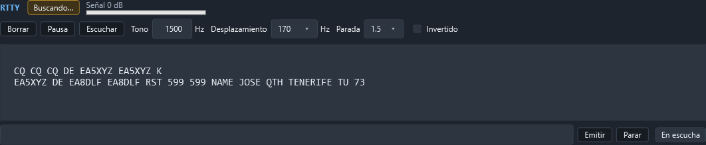
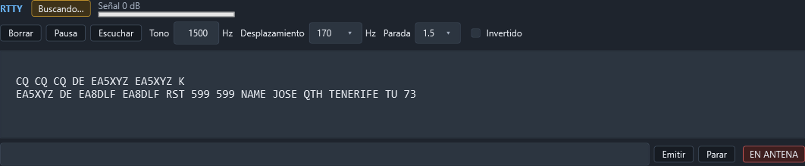

# RTTY

La página **Operar › RTTY** decodifica y transmite RTTY (radioteletipo) con el AFSK y el Baudot
del propio programa: no hace falta fldigi, MMTTY ni ningún otro programa, ni de un lado ni del
otro.

**A diferencia de CW, aquí sí se transmite desde el programa.** RTTY son dos tonos de audio (como
FT8), así que el PC genera el audio y lo saca por la tarjeta de sonido, con el PTT sostenido por
el mismo vigilante que usan el módem digital y la fonía.

## Dónde está

La página entera: arriba el estado y los mandos, en medio el texto recibido (como una terminal,
con desplazamiento), y abajo la línea de transmisión.

Escucha mientras se ve la página y no está en pausa, por la entrada elegida en
**Configuración › Audio y digitales**. Si esa entrada está cerrada, ofrece **Escuchar**, que la
abre sin tocar la radio. La entrada y la salida de audio se comparten con CW, el módem digital y
la fonía: nada se queda abierto cuando no hace falta.

## Qué enseña

- **Enganchado** o **Buscando…**: si el texto que llega tiene varios caracteres válidos seguidos
  (el bit de parada hace de validación), se engancha; el ruido no escribe nada.
- **Señal** en dB sobre el ruido.
- El **texto** recibido, en una terminal con desplazamiento. **Borrar** la limpia.

## El tono, el desplazamiento y la parada

Una sola señal sintonizada a la vez, como un TU de verdad: no hay varias señales leídas en
paralelo como en CW.

- **Tono**: el tono de marca, de 300 a 3000 Hz. Sirve igual para escuchar y para transmitir: es
  el mismo TU en los dos sentidos. Se escribe y se pulsa `Intro`, o se mueve con las flechas o la
  rueda del ratón (±10 Hz).
- **Desplazamiento**: 170 Hz (lo habitual en HF) u 850 Hz.
- **Parada**: 1, 1,5 (de fábrica, lo normal a 45,45 baudios) o 2 bits.
- **Invertido**: el tono de marca es el más bajo de los dos («reversa»). Con el filtro de BLU del
  equipo puesto al revés, se oye invertido.
- La velocidad está fija en 45,45 baudios (el «60 WPM» de radioaficionado): es con la que se
  trabaja casi siempre en HF.

El tono, el desplazamiento, la parada y la inversión se guardan solos: al volver a abrir el
programa siguen como se dejaron.

## Transmitir

Se escribe el texto en la casilla de abajo y se manda con `Intro` o el botón **Emitir**:

- La primera vez de la sesión se pregunta «¿Transmitir en RTTY?» —la misma pregunta, con el mismo
  «no volver a preguntar», que la telegrafía y la fonía—. Se puede apagar para siempre desde ahí,
  o encenderla otra vez en **Configuración › Audio y digitales**.
- Confirmado, se pide la antena al vigilante del PTT **una sola vez** y se genera y reproduce el
  audio del texto.
- Si ya se está transmitiendo, lo escrito se **encola** detrás, sin volver a preguntar: se puede
  seguir escribiendo mientras sale, como en la telegrafía.
- El PTT se suelta en cuanto se vacía la cola, se pulsa **Parar** o falla algo: nunca se queda
  pegado.

**EN ANTENA** / **En escucha** dice si el PTT está arriba por esta transmisión.

## El ruido no escribe

Como en CW, lo decodificado no se entrega hasta que se enganchan varios caracteres válidos
seguidos; uno inválido antes de engancharse lo tira todo. Ya enganchado, una ráfaga suelta de QRN
no desengancha la señal entera.
